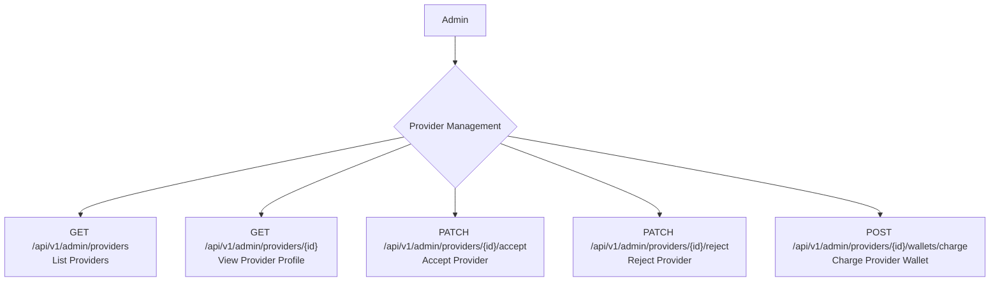

## Admin: Provider Management Workflow

Administrators have the authority to manage provider accounts. This includes reviewing provider applications, accepting or rejecting them, and viewing their profiles.

### Roles

*   **Admin**: A system administrator with privileges to manage the platform.

### Provider Management Flow



## API Endpoints

The following endpoints are used by administrators to manage providers.

### 1. List Providers

Admins can retrieve a list of all providers, which is useful for seeing pending applications and existing accounts.

*   **Endpoint**: `GET /api/v1/admin/providers`
*   **Description**: Returns a paginated list of all providers.

**Example Response**

```json
{
    "data": [
        {
            "id": 1,
            "name": "John Doe",
            "email": "john.doe@example.com",
            "status": "Pending",
            "created_at": "2023-10-27T10:00:00.000000Z"
        }
    ],
    "links": {
        "first": "/api/v1/admin/providers?page=1",
        "last": "/api/v1/admin/providers?page=3",
        "prev": null,
        "next": "/api/v1/admin/providers?page=2"
    },
    "meta": {
        "current_page": 1,
        "from": 1,
        "last_page": 3,
        "path": "/api/v1/admin/providers",
        "per_page": 15,
        "to": 15,
        "total": 45
    }
}
```

### 2. Show Provider Profile

Admins can view the detailed profile of a specific provider.

*   **Endpoint**: `GET /api/v1/admin/providers/{id}`
*   **Description**: Retrieves the full profile for a single provider.
*   **`{id}`**: The ID of the provider.

**Example Response**

```json
{
    "data": {
        "id": 1,
        "name": "John Doe",
        "email": "john.doe@example.com",
        "phone": "123-456-7890",
        "status": "Pending",
        "level": "Newbie",
        "rating": 0,
        "skills": [
            "Graphic Design",
            "Web Development"
        ],
        "created_at": "2023-10-27T10:00:00.000000Z"
    }
}
```

### 3. Accept a Provider

Admins can accept a provider's application, allowing them to offer services on the platform.

*   **Endpoint**: `PATCH /api/v1/admin/providers/{id}/accept`
*   **Description**: Marks a provider's account as accepted.
*   **`{id}`**: The ID of the provider to accept.

**Example Response**

```json
{
    "message": "Data updated successfully."
}
```

### 4. Reject a Provider

Admins can reject a provider's application.

*   **Endpoint**: `PATCH /api/v1/admin/providers/{id}/reject`
*   **Description**: Rejects a provider's application.
*   **`{id}`**: The ID of the provider to reject.

**Request Body**

| Field     | Type   | Rules                           |
|-----------|--------|---------------------------------|
| `message` | string | `required`, `string`, `max:500` |

**Example Response**

```json
{
    "message": "Data updated successfully."
}
```

### 5. Charge a Provider's Wallet

Admins can manually add funds to a provider's wallet.

*   **Endpoint**: `POST /api/v1/admin/providers/{id}/wallets/charge`
*   **Description**: Charges (adds funds to) a specific provider's wallet.
*   **`{id}`**: The ID of the provider whose wallet is to be charged.

**Request Body**

| Field    | Type    | Rules                         |
|----------|---------|-------------------------------|
| `amount` | numeric | `required`, `numeric`, `min:1`|

**Example Response**

```json
{
    "message": "Balance deposited successfully.",
    "data": {
        "balance": "1100.50"
    }
}
```

### Core Logic & Key Concepts

1.  **Status Management**: The core of this workflow is changing the provider's status.
    *   **Acceptance**: Sets the provider's status to `ACTIVE` (`1`). This makes the provider's profile and services live on the platform.
    *   **Rejection**: Sets the provider's status to `REJECTED` (`2`).

2.  **Transactional Email Update on Acceptance**: A key feature of the `ProviderAcceptationAction` is how it handles email updates. If a provider has a pending `reviewProvidersRequest` (meaning they likely updated their email during the application process), the system performs a critical swap within a database transaction:
    *   The email from the review request becomes the user's primary `email`.
    *   The `email_verified_at` timestamp is also transferred from the request, ensuring the new email is already marked as verified.
    *   The old email is saved to the provider's `contact_email` field for reference.
    *   The review request is deleted.
    This transactional approach ensures data integrity; if any step fails, the entire operation is rolled back.

3.  **Email Notifications**: The system automatically communicates with the provider at critical points:
    *   Upon acceptance, a `ProviderAcceptationMail` is sent to welcome the new provider.
    *   Upon rejection, a `ProviderRejection` email is sent. This email includes a custom message from the administrator, providing a reason for the rejection, which is crucial for transparency. 