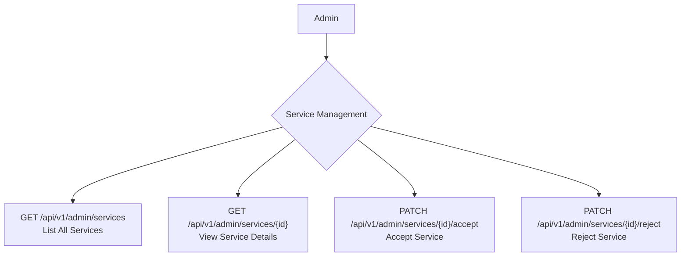

## Admin: Services Management Workflow

Administrators play a crucial role in maintaining the quality of services offered on the platform. They are responsible for reviewing services submitted by providers and deciding whether to accept or reject them based on platform guidelines.

### Roles

*   **Admin**: A system administrator responsible for quality control.

### Service Management Flow



## API Endpoints

The following endpoints are used by administrators to manage provider services.

### 1. List Services

Admins can retrieve a list of all services, often filtering for those pending review.

*   **Endpoint**: `GET /api/v1/admin/services`
*   **Description**: Returns a paginated list of all services submitted by providers.

**Example Response**
```json
{
    "data": [
        {
            "id": 1,
            "title": "Professional Logo Design",
            "description": "High-quality logo design for your brand.",
            "price": "150.00",
            "status": "Pending",
            "provider_id": 12,
            "created_at": "2023-10-27T10:00:00.000000Z"
        }
    ],
    "links": {
        "first": "/api/v1/admin/services?page=1",
        "last": "/api/v1/admin/services?page=5",
        "prev": null,
        "next": "/api/v1/admin/services?page=2"
    },
    "meta": {
        "current_page": 1,
        "from": 1,
        "last_page": 5,
        "path": "/api/v1/admin/services",
        "per_page": 15,
        "to": 15,
        "total": 75
    }
}
```

### 2. Show Service Details

To make an informed decision, admins can view the full details of a specific service.

*   **Endpoint**: `GET /api/v1/admin/services/{id}`
*   **Description**: Retrieves all details for a single service, including provider information.
*   **`{id}`**: The ID of the service.

**Example Response**
```json
{
    "data": {
        "id": 1,
        "title": "Professional Logo Design",
        "description": "Detailed description of the logo design service, including what the provider offers, the process, and deliverables.",
        "price": "150.00",
        "status": "Pending",
        "rejection_reason": null,
        "provider": {
            "id": 12,
            "name": "Creative Designs Co.",
            "email": "contact@creativedesigns.com"
        },
        "attachments": [
            {
                "id": 1,
                "path": "path/to/image.jpg",
                "type": "image"
            }
        ],
        "created_at": "2023-10-27T10:00:00.000000Z"
    }
}
```

### 3. Accept a Service

Admins can approve a service, making it visible and available for customers to order.

*   **Endpoint**: `PATCH /api/v1/admin/services/{id}/accept`
*   **Description**: Marks a service as accepted.
*   **`{id}`**: The ID of the service to accept.

**Example Response**
```json
{
    "message": "Data updated successfully."
}
```

### 4. Reject a Service

If a service does not meet the platform's standards, admins can reject it.

*   **Endpoint**: `PATCH /api/v1/admin/services/{id}/reject`
*   **Description**: Rejects a service, preventing it from being listed.
*   **`{id}`**: The ID of the service to reject.

**Request Body**

| Field     | Type   | Rules                           |
|-----------|--------|---------------------------------|
| `message` | string | `required`, `string`, `max:500` |

**Example Response**
```json
{
    "message": "Data updated successfully."
}
```

### Core Logic & Key Concepts

1.  **Quality Gatekeeping**: This workflow serves as a critical quality control point. No service submitted by a provider can become public until an administrator explicitly accepts it.

2.  **Status-Driven Visibility**: The `ServiceStatus` enum is central to this process.
    *   **Default Status**: When a provider submits a new service, it is created with a `PENDING` (`0`) status. It is not visible to customers.
    *   **Acceptance**: The `ServiceAcceptationAction` updates the service's status to `ACTIVE` (`1`). This makes the service visible and orderable by customers.
    *   **Rejection**: The `ServiceRejectionAction` updates the status to `REJECTED` (`2`). The service remains hidden from public view.

3.  **Provider Communication**: Clear communication with providers is built into the rejection process.
    *   When a service is rejected, the system sends a `ServiceRejection` email to the provider.
    *   This email includes a custom `message` from the administrator, explaining why the service was not approved. This feedback is essential for helping providers meet platform standards.

4.  **Audit Trail**: By changing the status rather than deleting rejected services, the system maintains a complete history of all service submissions and their outcomes. This is useful for administrative review and tracking provider performance. 