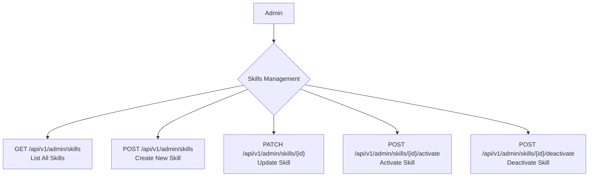

## Admin: Skills Management Workflow

Administrators are responsible for curating the master list of skills that providers can offer. This includes creating new skills, updating existing ones, and controlling their visibility by activating or deactivating them.

### Roles

*   **Admin**: A system administrator with privileges to manage platform settings.

### Skills Management Flow



## API Endpoints

The following endpoints are used by administrators to manage the global skills list.

### 1. List Skills

Admins can retrieve a list of all skills available on the platform, including their active status.

*   **Endpoint**: `GET /api/v1/admin/skills`
*   **Description**: Returns a paginated list of all skills.

**Example Response**

```json
{
    "data": [
        {
            "id": 1,
            "name": "Graphic Design",
            "is_active": true
        },
        {
            "id": 2,
            "name": "Content Writing",
            "is_active": false
        }
    ],
    "links": {
        "first": "/api/v1/admin/skills?page=1",
        "last": "/api/v1/admin/skills?page=5",
        "prev": null,
        "next": "/api/v1/admin/skills?page=2"
    },
    "meta": {
        "current_page": 1,
        "from": 1,
        "last_page": 5,
        "path": "/api/v1/admin/skills",
        "per_page": 15,
        "to": 15,
        "total": 75
    }
}
```

### 2. Create a Skill

Admins can add a new skill to the platform.

*   **Endpoint**: `POST /api/v1/admin/skills`
*   **Description**: Creates a new skill. The request body should contain the skill's name and any other required attributes.

**Request Body**

| Field  | Type   | Rules                                                    |
|--------|--------|----------------------------------------------------------|
| `name` | string | `required`, `string`, `min:2`, `max:50`, `unique:skills` |

**Example Response**

```json
{
    "message": "Data created successfully.",
    "data": {
        "id": 3,
        "name": "Digital Marketing",
        "is_active": true
    }
}
```

### 3. Update a Skill

Admins can change the details of an existing skill.

*   **Endpoint**: `PATCH /api/v1/admin/skills/{id}`
*   **Description**: Updates the specified skill.
*   **`{id}`**: The ID of the skill to update.

**Request Body**

| Field  | Type   | Rules                                                                  |
|--------|--------|------------------------------------------------------------------------|
| `name` | string | `required`, `string`, `min:2`, `max:50`, `unique:skills (ignores self)` |

**Example Response**

```json
{
    "message": "Data updated successfully.",
    "data": {
        "id": 2,
        "name": "Advanced Content Writing",
        "is_active": false
    }
}
```

### 4. Activate a Skill

Admins can make a skill "active," which means it will be visible and available for providers to add to their profiles.

*   **Endpoint**: `POST /api/v1/admin/skills/{id}/activate`
*   **Description**: Activates a specific skill.
*   **`{id}`**: The ID of the skill to activate.

**Example Response**

```json
{
    "message": "Data activated successfully."
}
```

### 5. Deactivate a Skill

Admins can deactivate a skill, making it unavailable for new provider profiles or services.

*   **Endpoint**: `POST /api/v1/admin/skills/{id}/deactivate`
*   **Description**: Deactivates a specific skill.
*   **`{id}`**: The ID of the skill to deactivate.

**Example Response**

```json
{
    "message": "Data deactivated successfully."
}
```

### Core Logic & Key Concepts

1.  **Centralized Skill Repository**: Unlike provider-specific skills, this workflow manages a global, master list of all skills available on the platform. The `skills` table acts as a single source of truth.

2.  **`is_active` Flag**: The visibility and availability of skills are controlled by a boolean `is_active` flag in the `skills` table.
    *   **Activation**: The `ActivateSkillsAction` sets `is_active` to `true`. This makes the skill visible across the platform, allowing providers to add it to their profiles.
    *   **Deactivation**: The `DeactivateSkillsAction` sets `is_active` to `false`. The skill is not deleted, but it is hidden from view and cannot be newly associated with any providers or services. It is effectively "soft-deleted".

3.  **Data Integrity**: By deactivating skills instead of deleting them, the system maintains historical data integrity. Providers who already have the skill associated with their profile will retain it, preventing data inconsistencies or errors in existing user profiles and services. This approach ensures that past records remain accurate. 