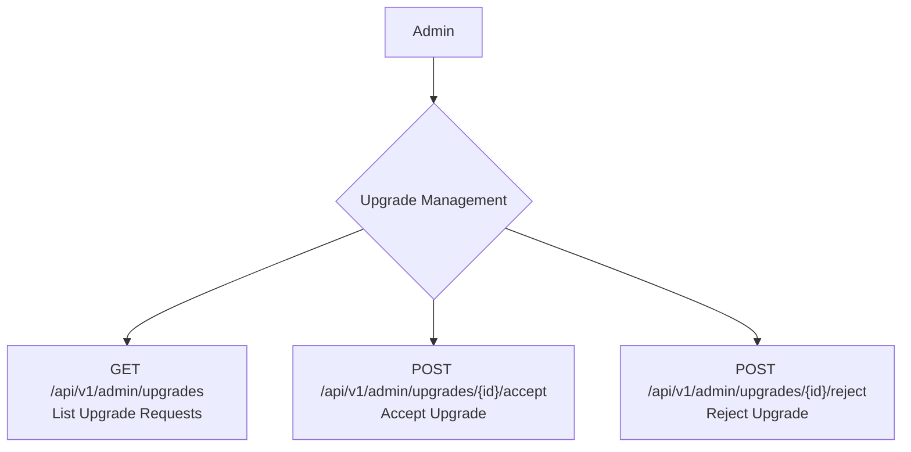

## Admin: Upgrades Management Workflow

Providers may request to upgrade their accounts to a different level or tier. Administrators are responsible for reviewing these requests and ensuring they meet the necessary criteria before approving or rejecting them.

### Roles

*   **Admin**: A system administrator who manages provider account statuses.

### Upgrade Management Flow



## API Endpoints

The following endpoints are used by administrators to manage provider upgrade requests.

### 1. List Upgrade Requests

Admins can view all pending and past upgrade requests from providers.

*   **Endpoint**: `GET /api/v1/admin/upgrades`
*   **Description**: Returns a paginated list of all provider upgrade requests.

**Example Response**
```json
{
    "data": [
        {
            "id": 1,
            "provider_id": 12,
            "level": "Pro",
            "status": "Pending",
            "requested_at": "2023-10-27T18:00:00.000000Z"
        }
    ],
    "links": {
        "first": "/api/v1/admin/upgrades?page=1",
        "last": "/api/v1/admin/upgrades?page=1",
        "prev": null,
        "next": null
    },
    "meta": {
        "current_page": 1,
        "from": 1,
        "last_page": 1,
        "path": "/api/v1/admin/upgrades",
        "per_page": 15,
        "to": 1,
        "total": 1
    }
}
```

### 2. Accept an Upgrade Request

Admins can approve a provider's request to upgrade their account level.

*   **Endpoint**: `POST /api/v1/admin/upgrades/{id}/accept`
*   **Description**: Accepts a provider's upgrade request.
*   **`{id}`**: The ID of the upgrade request to accept.

**Example Response**
```json
{
    "message": "Data updated successfully."
}
```

### 3. Reject an Upgrade Request

If a provider does not qualify for an upgrade, the admin can reject the request.

*   **Endpoint**: `POST /api/v1/admin/upgrades/{id}/reject`
*   **Description**: Rejects a provider's upgrade request.
*   **`{id}`**: The ID of the upgrade request to reject.

**Example Response**
```json
{
    "message": "Data updated successfully."
}
```

### Core Logic & Key Concepts

1.  **Status-Driven Workflow**: The entire upgrade management process is driven by the `status` field on the `upgrades` table. This field is controlled by the `UpgradeStatus` enum.
    *   **Default Status**: When a provider requests an upgrade, a new record is created with a default status of `PENDING` (`0`).
    *   **Acceptance**: The `UpgradeAcceptationAction` changes the status to `ACTIVE` (`1`). This signifies that the provider has been granted the new level or tier.
    *   **Rejection**: The `UpgradeRejectionAction` changes the status to `REJECTED` (`2`).

2.  **Simplicity of Logic**: The actions for this workflow are intentionally direct. They focus solely on updating the status of the request. There are no complex side effects like sending emails or notifications directly within these actions. The system relies on the status change to trigger any other necessary downstream processes (which are not part of this specific workflow).

3.  **Audit Trail**: By creating a record for each upgrade request and updating its status rather than deleting it, the system maintains a clear and auditable history of all upgrade requests and the decisions made by administrators. This is valuable for tracking provider progression and for reference in case of disputes. 