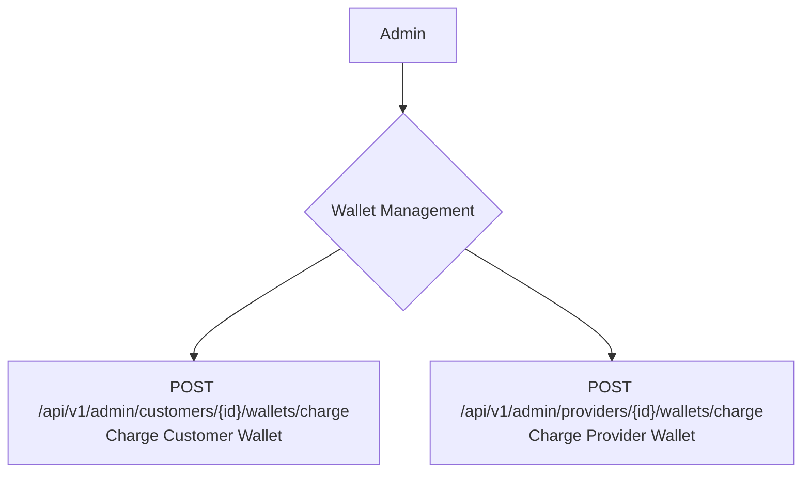

## Admin: Wallets Management Workflow

Administrators have the ability to manually charge (add funds to) the wallets of both customers and providers. This is typically done for adjustments, refunds, or promotional credits.

### Roles

*   **Admin**: A system administrator with financial management permissions.

### Wallet Charging Flow

## API Endpoints

The following endpoints are used by administrators to manage user wallets.

### 1. Charge a Customer's Wallet

Admins can add a specified amount to a customer's wallet.

*   **Endpoint**: `POST /api/v1/admin/customers/{id}/wallets/charge`
*   **Description**: Adds funds to a specific customer's wallet. The request body must contain the amount to be added.
*   **`{id}`**: The ID of the customer.

### 2. Charge a Provider's Wallet

Admins can add a specified amount to a provider's wallet.

*   **Endpoint**: `POST /api/v1/admin/providers/{id}/wallets/charge`
*   **Description**: Adds funds to a specific provider's wallet. The request body must contain the amount to be added.
*   **`{id}`**: The ID of the provider.

### Core Logic & Key Concepts

1.  **Shared Wallet Functionality**: The system uses a dedicated wallet management package (`bavix/laravel-wallet`). This package provides a standardized way to handle financial transactions for different user models. Both `Customer` and `Provider` models use a `HasWallet` trait, which gives them access to powerful, pre-built wallet functionalities.

2.  **`depositFloat` Method**: The core of this workflow is the `depositFloat` method provided by the wallet package.
    *   This method handles the creation of a new transaction record in a dedicated `transactions` table.
    *   It safely increments the user's `balance` in the `wallets` table. The use of `Float` ensures that balances are handled with decimal precision, which is crucial for financial calculations.
    *   It automatically associates the transaction with the correct user model (either a Customer or a Provider).

3.  **Transaction Metadata**: When an admin charges a wallet, the action includes descriptive metadata with the transaction (e.g., "Add balance to the wallet"). This information is stored with the transaction record and is essential for auditing and for generating clear financial statements for users.

4.  **Idempotency**: The wallet package is designed to be robust. While not explicitly shown in the action, these systems typically have mechanisms to prevent accidental duplicate transactions, ensuring that an admin action results in only one deposit. 