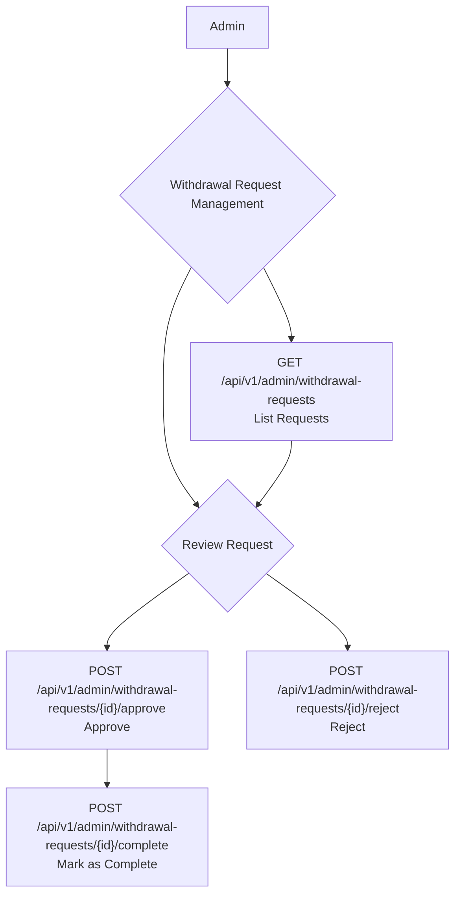

## Admin: Withdrawal Requests Management

Administrators oversee the process of provider withdrawals. They review requests, approve or reject them, and mark them as complete once the funds have been transferred.

### Roles

*   **Admin**: A system administrator with financial oversight.

### Withdrawal Request Flow

## API Endpoints

The following endpoints are used by administrators to manage provider withdrawal requests.

### 1. List Withdrawal Requests

Admins can view all withdrawal requests to see what needs to be processed.

*   **Endpoint**: `GET /api/v1/admin/withdrawal-requests`
*   **Description**: Returns a paginated list of all withdrawal requests.

### 2. Approve a Withdrawal Request

Admins can approve a request, confirming that the provider is eligible to withdraw the requested amount.

*   **Endpoint**: `POST /api/v1/admin/withdrawal-requests/{id}/approve`
*   **Description**: Approves a specific withdrawal request.
*   **`{id}`**: The ID of the withdrawal request.

### 3. Reject a Withdrawal Request

Admins can reject a request if there is an issue (e.g., insufficient funds, suspicious activity).

*   **Endpoint**: `POST /api/v1/admin/withdrawal-requests/{id}/reject`
*   **Description**: Rejects a specific withdrawal request.
*   **`{id}`**: The ID of the withdrawal request.

### 4. Complete a Withdrawal Request

After the funds have been successfully transferred to the provider's bank account externally, the admin marks the request as complete in the system.

*   **Endpoint**: `POST /api/v1/admin/withdrawal-requests/{id}/complete`
*   **Description**: Marks a withdrawal request as completed. This is the final step in the process.
*   **`{id}`**: The ID of the withdrawal request.

### Core Logic & Key Concepts

1.  **Multi-Stage, Status-Driven Process**: The entire workflow is governed by the `WithdrawalRequestStatus` enum, moving a request through a clear, multi-step process.
    *   `PENDING` (`0`): The initial state when a user submits a request. The funds have been withdrawn from their wallet and are held by the system.
    *   `APPROVED` (`1`): An admin has approved the request. The funds are now cleared for external transfer.
    *   `REJECTED` (`2`): An admin has rejected the request.
    *   `COMPLETED` (`3`): An admin has confirmed the external funds transfer is done.
    *   `CANCELED` (`4`): The user has canceled the request.

2.  **Transactional Fund Management**: The system ensures that money is never lost during the process.
    *   **On Rejection**: The `RejectWithdrawalRequestAction` performs a critical function within a database transaction: it updates the request status to `REJECTED` and immediately deposits the full requested amount *back* into the user's wallet using the `depositFloat` method. This guarantees that a rejected request automatically and safely returns the funds.
    *   **On Approval/Completion**: The actions for approval and completion only change the status. The actual debiting from the user's wallet happens when the request is first *created*, not when it's approved by an admin.

3.  **Separation of Concerns: Internal vs. External Payouts**: A key concept is the distinction between internal status updates and the real-world bank transfer.
    *   The "Complete" action (`CompleteWithdrawalRequestAction`) only updates the internal status to `COMPLETED`.
    *   The `//TODO: Make Payout` comment in the code explicitly states that the actual financial payout to a bank is an external process. The admin first performs the bank transfer and *then* marks the request as complete in the system to finalize the record. This separation prevents the system from automatically sending money without manual oversight. 