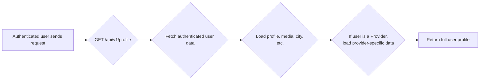
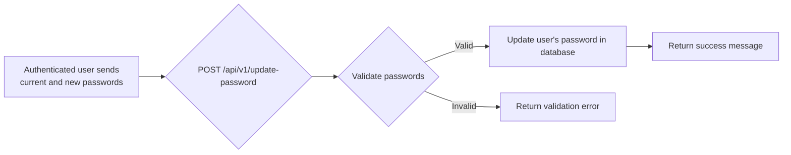
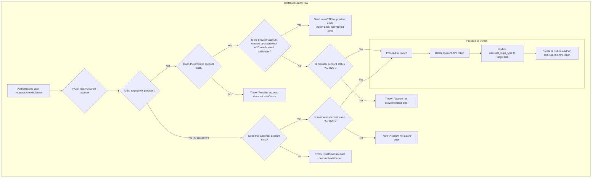

# Account Management

This workflow covers actions that a logged-in (authenticated) user can perform to manage their account.

---

## 1. Get Profile

This endpoint fetches the detailed profile of the currently authenticated user. For details on how to **update** this information, see the [Provider Profile Management](../provider/profile-management) or [Shared Profile Management](../shared/profile-management) documentation.

-   **Endpoint:** `GET /api/v1/profile`
-   **Method:** `GET`
-   **Authentication:** Required (User Token)

### Flow Diagram


### Success Response (200 OK)
Returns a detailed user object. The shape of the response varies depending on the user's `last_login_type`.

**Example for a Provider:**
```json
{
    "message": "Data retrieved successfully.",
    "data": {
        "id": 2,
        "first_name": "Provider",
        "last_name": "Test",
        "email": "provider@test.com",
        "phone": "987654321",
        "last_login_type": "provider",
        "provider": {
            "id": 1,
            "status": "active",
            // ... other provider fields
        },
        "profile": {
            // ... profile fields
        }
    }
}
```

---

## 2. Update Password

Allows an authenticated user to change their own password. This is part of the broader [Password Management](./password-management) workflow.

-   **Endpoint:** `POST /api/v1/update-password`
-   **Method:** `POST`
-   **Authentication:** Required (User Token)

### Flow Diagram


### Request Body

| Parameter               | Type   | Rules                                                      |
| ----------------------- | ------ | ---------------------------------------------------------- |
| `current_password`      | string | Required, must match the user's current password.          |
| `password`              | string | Required, new password. Must be at least 8 characters.     |
| `password_confirmation` | string | Required, must match the new `password`.                   |

### Success Response (200 OK)
```json
{
    "message": "Password updated successfully."
}
```

### Error Response (422 Unprocessable Entity)
- If the `current_password` is incorrect or the new password is weak.

---

## 3. Switch Account

Allows a user who has both a Customer and a Provider account to switch between them. This is a security-sensitive operation that invalidates the old token and returns a new one for the requested role. The validation logic is different depending on which role is being switched to.

### Flow Diagram


### Endpoint Details
-   **Endpoint:** `POST /api/v1/switch-account`
-   **Method:** `POST`
-   **Authentication:** Required (User Token)

### Request Body

| Parameter   | Type   | Rules                                             |
| ----------- | ------ | ------------------------------------------------- |
| `user_type` | string | Required, the type of account to switch to (`customer` or `provider`). |

### Success Response (200 OK)
Returns a user object with a **new token** for the switched-to role.
```json
{
    "message": "Account switched successfully.",
    "data": {
        "id": 2,
        "last_login_type": "provider",
        "token": "2|newProviderToken...", // New token is returned
        // ... other user details
    }
}
```

### Error Responses
- **403 Forbidden:**
  - If the account being switched to does not exist for this user.
  - If the target account's status is not `ACTIVE` (e.g., it is `REVIEWING` or `REJECTED`).
  - If switching to a provider account that was initiated by a customer and the email for it has not yet been verified.

---

### Code Highlights & Key Concepts

1.  **Authenticated User Helper (`getAuthenticatable()`)**: The `GetProfileAction` uses a global helper `getAuthenticatable()` to retrieve the currently logged-in user model. This is a clean way to get the authenticated instance without dependency injection.

2.  **Conditional Eager-Loading (`GetProfileAction`)**: To build the profile response, the action uses eager loading (`->load()`). It demonstrates a smart, conditional load: it always loads the base `profile`, but then it checks the user's `last_login_type` and only loads the `provider` or `customer` relationship that is relevant. This avoids unnecessary database queries.

3.  **Strict Validation Before Switching (`SwitchAccountAction`)**: Before any switch occurs, the system performs rigorous checks (`validateCustomer` and `validateProvider` methods). It verifies not only that the target role exists for the user (`$user->has_provider_account`) but also that its status is `ACTIVE`. This is a critical step to prevent users from switching to an incomplete, rejected, or still-under-review profile.

4.  **Special Verification for Customer-Initiated Providers (`SwitchAccountAction`)**: The system has a special flow for when a user tries to switch to a Provider account that was created for them *by a Customer*. The `handleEmailVerification` method checks if this is the case and if the user has verified their email for this new provider role. If not, it halts the switch, sends a new OTP, and returns a `403 Forbidden` error, forcing the user to verify their email before they can access that provider profile. This is a key security and ownership verification step.

5.  **Atomic Token Swap (`SwitchAccountAction`)**: The process of switching tokens is atomic and secure. The logic is explicit:
    a. **Delete Old Token**: The currently used API token is immediately deleted (`$auth->currentAccessToken()->delete()`). This invalidates the session for the previous role.
    b. **Update User State**: The `last_login_type` on the `User` model is updated and saved.
    c. **Issue New Token**: A brand new, role-specific token is generated for the new role (`$user->provider->createToken(...)`).
    This "delete-then-create" process ensures that there is no time window where both tokens are valid and guarantees that the returned token is the only valid one for the user.
