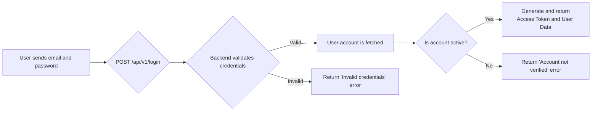
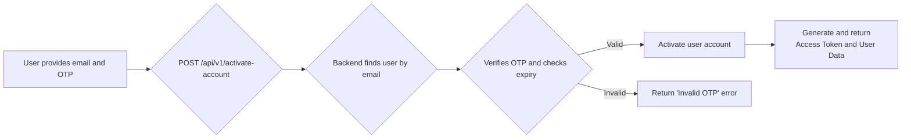
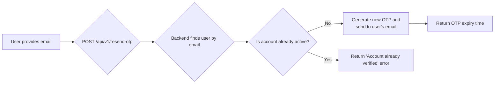

# Login and Activation

This document outlines the process for user login, account activation, and re-sending the One-Time Password (OTP). This workflow follows the initial [Registration](./registration) process.

---

## Flow Diagrams

### Login Flow


### Activation Flow


### Resend OTP Flow


---

## 1. Login

This endpoint authenticates a user and returns an access token if the credentials are valid and the account is active. If you have forgotten your password, please see the [Password Management](./password-management) workflow.

-   **Endpoint:** `POST /api/v1/login`
-   **Method:** `POST`
-   **Authentication:** Not required

### Request Body

| Parameter  | Type   | Rules             |
| ---------- | ------ | ----------------- |
| `email`    | string | Required, valid email. |
| `password` | string | Required.         |

### Success Response (200 OK)

Returns user data and an access token.
```json
{
    "message": "Login successful.",
    "data": {
        "id": 1,
        "first_name": "Khalid",
        "last_name": "Ghanim",
        "email": "khalid@test.com",
        "phone": "123456789",
        "account_type": "customer",
        "token": "1|abc..."
    }
}
```

### Error Responses
- **401 Unauthorized:** If credentials are invalid.
- **403 Forbidden:** If the account has not been verified/activated yet.


---

## 2. Activate Account

This endpoint activates a user's account using the OTP sent during the [Registration](./registration) process.

-   **Endpoint:** `POST /api/v1/activate-account`
-   **Method:** `POST`
-   **Authentication:** Not required

### Request Body

| Parameter | Type   | Rules                  |
| --------- | ------ | ---------------------- |
| `email`   | string | Required, valid email. |
| `otp`     | string | Required, 4 digits.    |

### Success Response (200 OK)

Returns user data and an access token, confirming the account is now active.
```json
{
    "message": "Account verified successfully.",
    "data": {
        "id": 1,
        "first_name": "Khalid",
        "last_name": "Ghanim",
        "email": "khalid@test.com",
        "phone": "123456789",
        "account_type": "customer",
        "token": "2|def..."
    }
}
```

### Error Response (422 Unprocessable Entity)
- If the OTP is invalid or expired.


---

## 3. Resend OTP

This endpoint resends an activation OTP to a user's registered email.

-   **Endpoint:** `POST /api/v1/resend-otp`
-   **Method:** `POST`
-   **Authentication:** Not required

### Request Body

| Parameter | Type   | Rules                  |
| --------- | ------ | ---------------------- |
| `email`   | string | Required, valid email. |

### Success Response (200 OK)

```json
{
    "message": "OTP has been resent successfully.",
    "data": {
        "end_at": "2024-08-01T12:05:00.000000Z"
    }
}
```
- `end_at`: The new expiry timestamp for the resent OTP.

### Error Response (400 Bad Request)
- If the account is already verified.

---

### Code Highlights & Key Concepts

#### Login (`LoginAction`)

1.  **Rate Limiting**: The login attempt is rate-limited by email address (`RateLimiter::attempt`). This prevents brute-force attacks. If a user makes too many failed attempts (5 in this case), they are locked out for a period of time (900 seconds / 15 minutes).
2.  **Custom Authentication Guard**: The code uses a specific auth guard `Auth::shouldUse('user-login')` before attempting to authenticate. This is important for applications that have multiple user models or authentication systems (e.g., one for regular users, one for admins).
3.  **Post-Authentication Checks**: After a successful password verification with `Auth::attempt()`, the code performs several crucial checks:
    *   **Email Verification**: It checks if `email_verified_at` is set. If not, it throws an error and re-sends an OTP, preventing unverified users from logging in.
    *   **Account Status**: It checks the `status` of the specific user type (`customer` or `provider`). A provider who is still `REVIEWING` or has been `REJECTED` cannot log in. This logic is separated into `validateCustomer` and `validateProvider` methods.
4.  **Scoped Token Generation**: Upon successful login, a Sanctum API token is created specifically for the user's role (`$user->customer->createToken(...)` or `$user->provider->createToken(...)`). This means a customer token cannot be used to access provider-only endpoints, and vice-versa.

#### Activate Account (`ActivateAccountAction`)

1.  **OTP Validation**: The action first checks if the account isn't already verified. It then validates that the provided OTP matches the one in the database and that it has not expired (`$user->otpVerification->expires_at->isPast()`).
2.  **Status Update Logic**:
    *   If the user is a **Customer**, their status is immediately set to `ACTIVE`, and they are issued an API token, allowing them to log in and use the app.
    *   If the user is a **Provider**, their status is set to `REVIEWING`. They are **not** issued a token yet. Instead, an email (`ProviderReviewingMail`) is sent to them, informing them that their account is pending admin approval. They will only be able to log in after an admin activates their account.
3.  **OTP Deletion**: Upon successful verification, the OTP record is deleted from the database (`$user->otpVerification()->delete()`) to prevent it from being used again.

#### Resend OTP (`ResendOtpAction`)

1.  **Time-Based Rate Limiting**: This action has a different kind of rate limit. It checks if an OTP was recently sent (`$otpVerification->wasRecentlyCreated` or if 5 minutes have passed since the last update). This prevents users from spamming the OTP email service. If the user tries to resend too soon, it returns a `429 Too Many Requests` error and tells them how long they need to wait.
