# Login and Activation

This document outlines the process for user login, account activation, and re-sending the One-Time Password (OTP).

---

## Flow Diagram

```mermaid
graph TD;
    subgraph "Login Flow"
        A[User sends email and password] --> B{POST /api/v1/login};
        B --> C{Backend validates credentials};
        C -- Valid --> D[User account is fetched];
        D --> E{Is account active?};
        E -- Yes --> F[Generate and return<br/>Access Token & User Data];
        E -- No --> G[Return 'Account not verified' error];
        C -- Invalid --> H[Return 'Invalid credentials' error];
    end

    subgraph "Activation Flow"
        I[User provides email and OTP] --> J{POST /api/v1/activate-account};
        J --> K{Backend finds user by email};
        K --> L{Verifies OTP and checks expiry};
        L -- Valid --> M[Activate user account];
        M --> N[Generate and return<br/>Access Token & User Data];
        L -- Invalid --> O[Return 'Invalid OTP' error];
    end

    subgraph "Resend OTP Flow"
        P[User provides email] --> Q{POST /api/v1/resend-otp};
        Q --> R{Backend finds user by email};
        R --> S{Is account already active?};
        S -- No --> T[Generate new OTP and<br/>send to user's email];
        T --> U[Return OTP expiry time];
        S -- Yes --> V[Return 'Account already verified' error];
    end
```



---

## 1. Login

This endpoint authenticates a user and returns an access token if the credentials are valid and the account is active.

-   **Endpoint:** `POST /api/v1/login`
-   **Method:** `POST`
-   **Authentication:** Not required

### Request Body

| Parameter  | Type   | Rules             |
| ---------- | ------ | ----------------- |
| `email`    | string | Required, valid email. |
| `password` | string | Required.         |

### Success Response (200 OK)

Returns user data and an access token.
```json
{
    "message": "Login successful.",
    "data": {
        "id": 1,
        "first_name": "Khalid",
        "last_name": "Ghanim",
        "email": "khalid@test.com",
        "phone": "123456789",
        "account_type": "customer",
        "token": "1|abc..."
    }
}
```

### Error Responses
- **401 Unauthorized:** If credentials are invalid.
- **403 Forbidden:** If the account has not been verified/activated yet.


---

## 2. Activate Account

This endpoint activates a user's account using the OTP sent during registration.

-   **Endpoint:** `POST /api/v1/activate-account`
-   **Method:** `POST`
-   **Authentication:** Not required

### Request Body

| Parameter | Type   | Rules                  |
| --------- | ------ | ---------------------- |
| `email`   | string | Required, valid email. |
| `otp`     | string | Required, 4 digits.    |

### Success Response (200 OK)

Returns user data and an access token, confirming the account is now active.
```json
{
    "message": "Account verified successfully.",
    "data": {
        "id": 1,
        "first_name": "Khalid",
        "last_name": "Ghanim",
        "email": "khalid@test.com",
        "phone": "123456789",
        "account_type": "customer",
        "token": "2|def..."
    }
}
```

### Error Response (422 Unprocessable Entity)
- If the OTP is invalid or expired.


---

## 3. Resend OTP

This endpoint resends an activation OTP to a user's registered email.

-   **Endpoint:** `POST /api/v1/resend-otp`
-   **Method:** `POST`
-   **Authentication:** Not required

### Request Body

| Parameter | Type   | Rules                  |
| --------- | ------ | ---------------------- |
| `email`   | string | Required, valid email. |

### Success Response (200 OK)

```json
{
    "message": "OTP has been resent successfully.",
    "data": {
        "end_at": "2024-08-01T12:05:00.000000Z"
    }
}
```
- `end_at`: The new expiry timestamp for the resent OTP.

### Error Response (400 Bad Request)
- If the account is already verified.
