# Password Management

This workflow details the three-step process for a user to reset their password.

---

## Flow Diagram

```mermaid
graph TD;
    subgraph "Step 1: Request Reset"
        A["User submits email"] --> B{"POST /api/v1/forget-password"};
        B --> C{"Find user by email"};
        C --> D{"Has OTP been sent recently?"};
        D -- No --> E["Generate & save new OTP<br>Send OTP to user's email"];
        E --> F["Return success message with<br>next OTP request time"];
        D -- Yes --> G["Return 'Wait before sending again' error"];
    end

    subgraph "Step 2: Verify OTP"
        H["User submits email and OTP"] --> I{"POST /api/v1/check-otp"};
        I --> J{"Find user by email"};
        J --> K{"Is OTP valid and not expired?"};
        K -- Yes --> L["Return success message"];
        K -- No --> M["Return 'Invalid OTP' error"];
    end

    subgraph "Step 3: Reset Password"
        N["User submits email, OTP,<br>and new password"] --> O{"POST /api/v1/reset-password"};
        O --> P{"Re-verify OTP (security check)"};
        P -- Valid --> Q["Update user's password"];
        Q --> R["Delete OTP record"];
        R --> S["Send 'Password was reset' email"];
        S --> T["Return success message"];
        P -- Invalid --> U["Return 'Invalid OTP' error"];
    end
```



---

## 1. Forget Password

This endpoint initiates the password reset process by sending an OTP to the user's registered email.

-   **Endpoint:** `POST /api/v1/forget-password`
-   **Method:** `POST`
-   **Authentication:** Not required

### Request Body

| Parameter | Type   | Rules                  |
| --------- | ------ | ---------------------- |
| `email`   | string | Required, valid email. |

### Success Response (200 OK)
```json
{
    "message": "An OTP has been sent to your email.",
    "data": {
        "end_at": "2024-08-01T12:05:00.000000Z"
    }
}
```
-   `end_at`: The timestamp indicating the earliest time the user can request another OTP.

### Error Response (429 Too Many Requests)
-   If the user requests an OTP less than 5 minutes after the previous request.

---

## 2. Check Forget Password OTP

This endpoint verifies the OTP that the user received.

-   **Endpoint:** `POST /api/v1/check-otp`
-   **Method:** `POST`
-   **Authentication:** Not required

### Request Body

| Parameter | Type   | Rules                  |
| --------- | ------ | ---------------------- |
| `email`   | string | Required, valid email. |
| `otp`     | string | Required, 4 digits.    |

### Success Response (200 OK)
```json
{
    "message": "OTP is valid."
}
```

### Error Responses
- **422 Unprocessable Entity:** If the OTP is incorrect.
- **422 Unprocessable Entity:** If the OTP has expired.
- **429 Too Many Requests:** If the user makes too many invalid attempts.

---

## 3. Reset Password

This endpoint sets a new password for the user after a successful OTP check.

-   **Endpoint:** `POST /api/v1/reset-password`
-   **Method:** `POST`
-   **Authentication:** Not required

### Request Body

| Parameter             | Type   | Rules                                                                       |
| --------------------- | ------ | --------------------------------------------------------------------------- |
| `email`               | string | Required, valid email.                                                      |
| `otp`                 | string | Required, must be the valid 4-digit OTP.                                    |
| `password`            | string | Required, new password. Must be at least 8 characters and confirmed.        |
| `password_confirmation`| string | Required, must match the `password` field.                                 |


### Success Response (200 OK)
```json
{
    "message": "Password has been reset successfully."
}
```

### Error Response
- **422 Unprocessable Entity:** If the OTP is invalid or the new password is weak.

---

### Code Highlights & Key Concepts

1.  **Time-Gated OTP Requests (`ForgetPasswordAction`)**: To prevent email spam, the system checks if a password reset was recently requested for the user. If a request was made less than 5 minutes ago, it throws a `429 Too Many Requests` error and informs the user how long they must wait. This logic is separate from the OTP's own 15-minute expiry time.

2.  **Rate Limiting on OTP Check (`CheckForgetPasswordOtpAction`)**: The action to verify the OTP is rate-limited. This protects against brute-force attacks where an attacker tries to guess the 4-digit code. After 5 failed attempts, the user is locked out for 10 minutes.

3.  **Secure Reset Process (`ResetPasswordAction`)**:
    *   The `ResetPasswordAction` does not blindly trust the user's request. As a first step, it re-runs the entire `CheckForgetPasswordOtpAction` logic internally. This is a critical security measure that ensures the OTP is still valid and hasn't been used or expired in the time between the user checking the OTP and submitting a new password.
    *   After successfully updating the password, the OTP record is immediately deleted (`$passwordRestObject->delete()`) from the `reset_passwords` table. This invalidates the token completely, ensuring it cannot be used for any further password reset attempts.
    *   Finally, a notification email (`PasswordResetMail`) is sent to the user, alerting them that their password has been changed, which is an important security feature.
