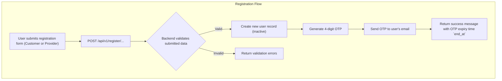

# Registration

This workflow covers the registration process for both Customers and Providers.

---

## Flow Diagram



---

## 1. Customer Registration

This endpoint allows a new user to register as a Customer.

-   **Endpoint:** `POST /api/v1/register/customer`
-   **Method:** `POST`
-   **Authentication:** Not required

### Request Body

| Parameter        | Type    | Rules                                                                                                                                                                                                                           |
| ---------------- | ------- | ------------------------------------------------------------------------------------------------------------------------------------------------------------------------------------------------------------------------------- |
| `first_name`     | string  | Required. Must contain only letters (Arabic/English) and spaces. Min 2, max 50 characters.                                                                                                                                        |
| `last_name`      | string  | Required. Must contain only letters (Arabic/English) and spaces. Min 2, max 50 characters.                                                                                                                                        |
| `email`          | string  | Required. Must be a valid email format and unique in the `users` table.                                                                                                                                                         |
| `password`       | string  | Required. Must be at least 8 characters long and contain letters, mixed case, numbers, and symbols. Must be sent with a matching `password_confirmation` field.                                                                   |
| `phone`          | string  | Required. Must be a unique phone number in the `users` table. Must contain only digits, between 8 and 15 digits long.                                                                                                             |
| `phone_country`  | string  | Required. Must be a valid country code (e.g., "SA", "US").                                                                                                                                                                      |
| `gender`         | string  | Required. Must be one of the allowed gender values (e.g., `male`, `female`).                                                                                                                                                    |
| `city_id`        | integer | Required. Must be a valid ID of a city from the `cities` table.                                                                                                                                                                 |
| `nationality_id` | integer | Required. Must be a valid ID of a nationality from the `nationalities` table.                                                                                                                                                   |
| `avatar`         | file    | Optional. Must be an image file (e.g., png, jpg) with a maximum size of 2MB.                                                                                                                                                    |

### Success Response

-   **Code:** `200 OK`
-   **Content:**
    ```json
    {
        "message": "Data created successfully.",
        "data": {
            "end_at": "2024-08-01T12:00:00.000000Z"
        }
    }
    ```
    -   `end_at`: The timestamp indicating when the OTP for account activation will expire.

---

## 2. Provider Registration

This endpoint allows a new user to register as a Provider (Individual or Establishment).

-   **Endpoint:** `POST /api/v1/register/provider`
-   **Method:** `POST`
-   **Authentication:** Not required

### Request Body

| Parameter            | Type         | Rules                                                                                                                                                                                                     |
| -------------------- | ------------ | --------------------------------------------------------------------------------------------------------------------------------------------------------------------------------------------------------- |
| `first_name`         | string       | Required. Min 2, max 50 characters. Must contain only letters (Arabic/English) and spaces.                                                                                                                |
| `last_name`          | string       | Required. Min 2, max 50 characters. Must contain only letters (Arabic/English) and spaces.                                                                                                                |
| `email`              | string       | Required. Must be a valid email format and unique in the `users` table.                                                                                                                                   |
| `contact_email`      | string       | Required. Must be a valid email format and unique in the `providers` table.                                                                                                                               |
| `password`           | string       | Required. Must be at least 8 characters and contain letters, mixed case, numbers, and symbols. Must be sent with a matching `password_confirmation` field.                                                  |
| `phone`              | string       | Required. Must be a unique phone number. Must contain only digits, between 8 and 15 digits long.                                                                                                          |
| `phone_country`      | string       | Required. Must be a valid country code.                                                                                                                                                                   |
| `gender`             | string       | Required. Must be one of the allowed gender values.                                                                                                                                                       |
| `city_id`            | integer      | Required. Must be a valid city ID.                                                                                                                                                                        |
| `nationality_id`     | integer      | Required. Must be a valid nationality ID.                                                                                                                                                                 |
| `account_type`       | string       | Required. The type of provider account (e.g., `establishment`, `individual`).                                                                                                                             |
| `establishment_date` | date         | Required if `account_type` is `establishment`. A valid date.                                                                                                                                              |
| `avatar`             | file         | Optional. Image file (png, jpg, jpeg) up to 2MB.                                                                                                                                                          |
| `authorization_form` | array of files | Required if `account_type` is `establishment`. An array of files (jpg, jpeg, png, pdf), each up to 2MB.                                                                                                    |
| `commercial_file`    | array of files | Required if `account_type` is `establishment`. An array of files (jpg, jpeg, png, pdf), each up to 2MB.                                                                                                    |
| `tax_file`           | array of files | Required if `account_type` is `establishment`. An array of files (jpg, jpeg, png, pdf), each up to 2MB.                                                                                                    |

### Success Response

-   **Code:** `200 OK`
-   **Content:**
    ```json
    {
        "message": "Data created successfully.",
        "data": {
            "end_at": "2024-08-01T12:00:00.000000Z"
        }
    }
    ```
    -   `end_at`: The timestamp indicating when the OTP for account activation will expire.
