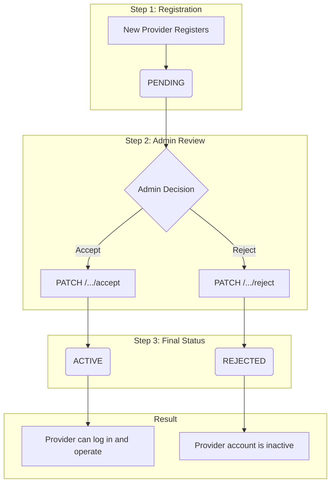
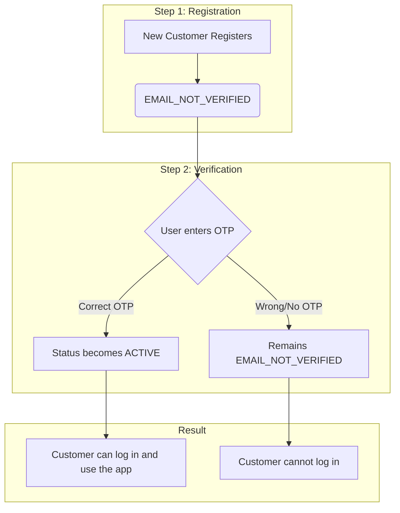

## Registration Workflow

This workflow covers the creation of new user accounts on the platform. The process is similar for both Customers and Providers, with the primary difference being the amount of data required. The core steps involve submitting registration data, receiving an an email, and using it to activate the account.

## API Endpoint

### 1. Register a New User

-   **Endpoint**:
    -   `POST /api/v1/auth/register/customer`
    -   `POST /api/v1/auth/register/provider`
-   **Description**: Creates a new user account (Customer or Provider).
-   **Auth**: None.

### Request Body (Customer)

| Field            | Type    | Rules                                    |
| ---------------- | ------- | ---------------------------------------- |
| `full_name`      | string  | `required`, `string`, `max:255`          |
| `email`          | string  | `required`, `email`, `unique:users,email`|
| `password`       | string  | `required`, `confirmed`, `min:8`         |
| `phone_country`  | string  | `required`, `exists:countries,code`      |
| `phone`          | string  | `required`, `unique:users,phone`         |
| `fcm_token`      | string  | `required`                               |

### Request Body (Provider)

Providers require significantly more information during registration.

| Field                | Type           | Rules                                                              |
| -------------------- | -------------- | ------------------------------------------------------------------ |
| `full_name`          | string         | `required`, `string`, `max:255`                                    |
| `email`              | string         | `required`, `email`, `unique:users,email`                          |
| `password`           | string         | `required`, `confirmed`, `min:8`                                   |
| `phone_country`      | string         | `required`, `exists:countries,code`                                |
| `phone`              | string         | `required`, `unique:users,phone`                                   |
| `fcm_token`          | string         | `required`                                                         |
| `city_id`            | integer        | `required`, `exists:cities,id`                                     |
| `nationality_id`     | integer        | `required`, `exists:nationalities,id`                              |
| `account_type`       | string         | `required`, `in:individual,establishment`                          |
| `establishment_date` | date           | `required_if:account_type,establishment`                           |
| `avatar`             | file (image)   | `sometimes`, `image`, `mimes:png,jpg,jpeg`, `max:2048`              |
| `authorization_form` | array of files | `required_if:account_type,establishment`, `array`, `max:5`         |
| `commercial_file`    | array of files | `required_if:account_type,establishment`, `array`, `max:5`         |
| `tax_file`           | array of files | `required_if:account_type,establishment`, `array`, `max:5`         |

### Core Logic & Key Concepts

1.  **Transactional Integrity**: The entire registration process, including user creation, profile creation, and media uploads, is wrapped in a `DB::transaction()`. This ensures that if any part of the process fails (e.g., an error during file upload), the entire operation is rolled back, preventing partial or corrupt user data from being saved.

2.  **OTP Generation and Mailing**: Upon successful data creation, the system generates a unique One-Time Password (OTP) and an expiration time (e.g., 15 minutes). It then sends this OTP to the user's registered email address using the `RegistrationOtp` Mailable. This is a critical security step to verify that the user owns the email address they provided.

3.  **Multiple File Collections**: For establishment providers, the system handles multiple file uploads. It iterates through each array of files (`authorization_form`, `commercial_file`, etc.) and attaches them to the Provider's media library, each in its own distinct collection. This keeps the provider's documents organized and easy to retrieve.

### Provider Registration and Initial Status

When a new provider registers, their account is created, but it is not immediately active. The system assigns them an initial status, which is then reviewed by an administrator. This is the starting point for the [Provider Management (Admin)](./../admin/provider-management.md) workflow.

### User Statuses

The `status` attribute on a user (including providers) can have one of the following values, managed by the `UserStatus` enum:

*   **`PENDING`**: This is the default status for a newly registered provider. Their application is awaiting review from a platform administrator.
*   **`REVIEWING`**: An administrator is currently looking at the application. (Note: This status is available but may not be used in all workflows).
*   **`ACTIVE`**: The provider's application has been accepted by an admin, or the customer has verified their email. Their profile is live.
*   **`REJECTED`**: An admin has rejected the provider's application. The account is not active.
*   **`EMAIL_NOT_VERIFIED`**: The user has not yet verified their email address by entering the OTP. The account cannot be used until the email is verified.

### Provider Status Flow

The following diagram illustrates the lifecycle of a provider's status from initial registration to final approval or rejection.

1.  **Pending**: Upon successful registration, a provider's account is automatically set to `PENDING`. They cannot offer services yet.
2.  **Admin Decision**: The application appears in the admin's management queue. The admin can either `Accept` or `Reject` the application.
3.  **Active**: If accepted, the status changes to `ACTIVE`. The provider is notified, and their profile becomes live on the platform.
4.  **Rejected**: If rejected, the status changes to `REJECTED`. The provider is notified, and the account remains inactive.

### Customer Status Flow

The customer account lifecycle is simpler and does not require admin approval. It is focused on email verification.

1.  **Email Not Verified**: Upon successful registration, the customer's account is created with an `EMAIL_NOT_VERIFIED` status. They are sent an OTP code via email.
2.  **Active**: Once the customer successfully verifies their account using the OTP, their status automatically changes to `ACTIVE`. They can now log in and use all platform features. 