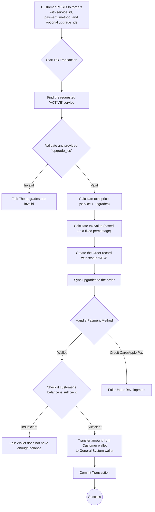
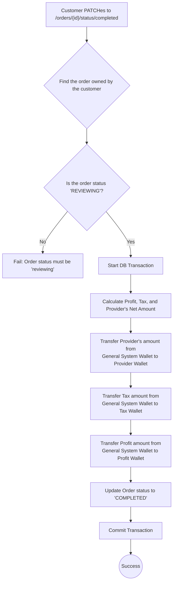

# Order Management (Customer)

This workflow details the order-related actions that a Customer can perform, such as creating a new order and marking a completed order. For shared actions like cancellations, please refer to the main [Order Management documentation](../shared/orders-management).

---

## 1. Create a New Order

This endpoint allows a customer to purchase a service. The process involves calculating the total price (including optional upgrades and tax), validating the payment method, and creating the order record.

-   **Endpoint:** `POST /api/v1/orders`
-   **Authorization:** Bearer Token (Customer)
-   **Action:** `Customers\Orders\StoreOrderAction`

### Process Flow

### Request Body

| Field          | Type    | Rules                                  | Description                                           |
| -------------- | ------- | -------------------------------------- | ----------------------------------------------------- |
| `service_id`   | `integer`| `required`, `exists:services,id`         | The ID of the service being ordered.                  |
| `method_type`  | `enum`  | `required`, `in:wallet,credit_card...` | The chosen payment method.                            |
| `upgrades_ids` | `array` | `sometimes`                            | An array of IDs for any selected service upgrades.    |

---

## 2. Mark an Order as Completed

This action is performed by the customer to confirm they are satisfied with the completed work. This is a critical step that triggers the distribution of funds from the system's holding account to the provider and other system wallets.

-   **Endpoint:** `PATCH /api/v1/orders/{id}/status/completed`
-   **Authorization:** Bearer Token (Customer)
-   **Action:** `Customers\Orders\ChangeOrderStatusToCompletedAction`

### Process Flow

### Code Highlights & Key Concepts

*   **Transactional Integrity**: Both order creation and completion are wrapped in `DB::transaction()`. This is essential for financial operations. If a customer's wallet payment succeeds but the order record fails to be created, the entire operation is rolled back, preventing the customer from being charged for nothing.
*   **Wallet System (`bavix/laravel-wallet`)**: The application uses a robust wallet package to manage all financial transactions.
    *   **Initial Payment:** When an order is created via the wallet, the total amount is moved from the customer's wallet to a `General System` wallet. This acts as an escrow system.
    *   **Fund Distribution:** The `ChangeOrderStatusToCompletedAction` is the key to the business logic. When an order is marked complete, this action calculates the platform's profit (20% of total) and the tax on that profit (15% of the profit). It then executes three separate, logged `transferFloat` operations to move the correct amounts from the `General System` wallet to the **Provider's wallet**, the dedicated **Taxes wallet**, and the dedicated **Profits wallet**.
*   **Idempotency & Status Checks**: The completion action explicitly checks if the order status is `REVIEWING`. This prevents a customer from accidentally or maliciously completing an order multiple times, which would re-trigger the fund distribution logic. It ensures the financial transaction can only happen once per order.
*   **Clear Financial Logging**: Each `transferFloat` operation includes a detailed `Extra` object with descriptions in both Arabic and English. This creates an auditable and clear transaction history for every movement of funds, which is crucial for financial tracking and dispute resolution.

This concludes the documentation for Customer Order Management. 