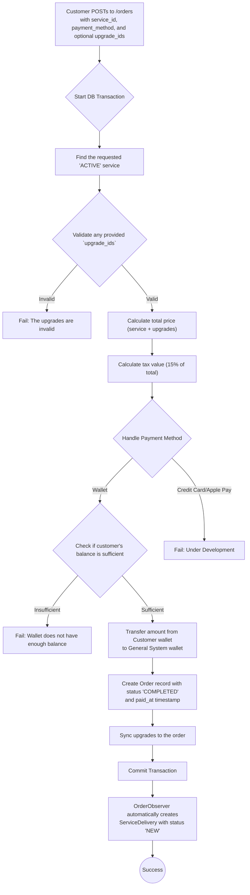
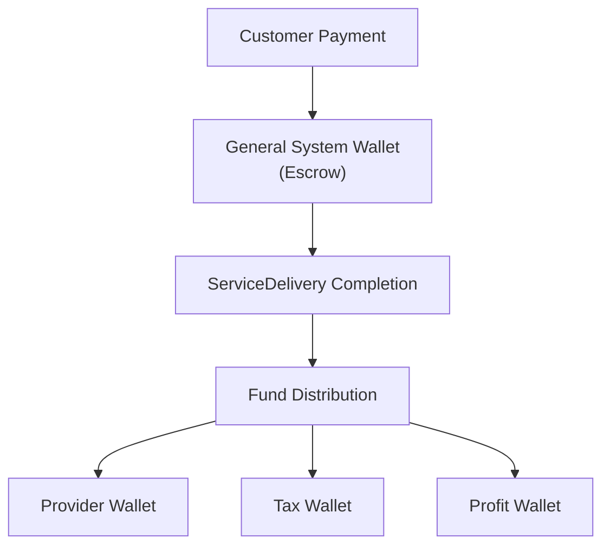

# Order Management (Customer)

This workflow details the order-related actions that a Customer can perform, specifically creating and paying for orders. **Important:** In the updated system, Orders handle payment processing only. Once an order is successfully paid and marked as `COMPLETED`, the system automatically creates a ServiceDelivery for the actual service execution workflow.

---

## 1. Create and Pay for a New Order

This endpoint allows a customer to purchase a service. The process involves calculating the total price (including optional upgrades and tax), validating the payment method, processing payment, and creating the order record. Upon successful payment, the order is immediately marked as `COMPLETED` and a ServiceDelivery is automatically created.

-   **Endpoint:** `POST /api/v1/orders`
-   **Authorization:** Bearer Token (Customer)
-   **Action:** `Customers\Orders\StoreOrderAction`

### Process Flow


### Request Body

| Field          | Type    | Rules                                  | Description                                           |
| -------------- | ------- | -------------------------------------- | ----------------------------------------------------- |
| `service_id`   | `integer`| `required`, `exists:services,id`         | The ID of the service being ordered.                  |
| `method_type`  | `enum`  | `required`, `in:wallet,credit_card...` | The chosen payment method.                            |
| `upgrades_ids` | `array` | `sometimes`                            | An array of IDs for any selected service upgrades.    |

### Example Response

```json
{
    "success": true,
    "message": "Order created successfully",
    "data": null
}
```

---

## Key Changes in the New System

### **Order vs ServiceDelivery Separation**

The system now clearly separates financial operations from service execution:

- **Orders**: Handle payment processing, financial transactions, and money flow
- **ServiceDeliveries**: Handle actual service execution, delivery tracking, and customer-provider interaction

### **Automatic ServiceDelivery Creation**

When an order reaches `COMPLETED` status (successful payment), the `OrderObserver` automatically:

1. Creates a corresponding `ServiceDelivery` record
2. Sets ServiceDelivery status to `NEW` 
3. Copies relevant service information from the order
4. Links the ServiceDelivery to the provider and customer

### **Financial Flow**



**Payment Process:**
1. **Order Creation**: Customer pays → funds move to `General System` wallet (escrow)
2. **Service Completion**: When ServiceDelivery is completed → funds are distributed
3. **Distribution**: Platform profit (20%), tax on profit (15%), remainder to provider

### **Next Steps After Order Creation**

After a successful order:
1. Customer receives confirmation
2. ServiceDelivery is automatically created with status `NEW`
3. Provider can see the new ServiceDelivery in their dashboard
4. Provider begins the service execution workflow (see [ServiceDelivery Management](../shared/service-delivery-management.md))

---

## Code Highlights & Key Concepts

*   **Transactional Integrity**: Order creation is wrapped in `DB::transaction()`. If payment succeeds but order creation fails, the entire operation is rolled back.
*   **Observer Pattern**: `OrderObserver` watches for status changes and automatically creates ServiceDeliveries when orders are completed.
*   **Wallet System (`bavix/laravel-wallet`)**: 
    *   **Escrow System**: Payments are held in a `General System` wallet until service completion
    *   **Immediate Payment**: Orders are created with `COMPLETED` status after successful payment
*   **Status Separation**: 
    *   Order statuses focus on payment: `PENDING`, `COMPLETED`, `FAILED`, `REFUNDED`
    *   ServiceDelivery statuses focus on execution: `NEW`, `IN_PROGRESS`, `REVIEWING`, `COMPLETED`, `CANCELLED`

For service execution workflows, see the [ServiceDelivery Management documentation](../shared/service-delivery-management.md). 