# Provider Interactions

This workflow covers how a Customer can view and interact with Providers. This includes viewing provider profiles, their services, and their reviews, as well as the process for a Customer to activate their own Provider account, which sends their application to the administration for review.

---

## 1. View Provider & Service Information

These endpoints allow customers to browse provider profiles and see the services they offer.

*   **View Provider Profile:** `GET /api/v1/providers/{id}`
    *   Fetches public details for a specific provider, including their skills, level, and profile info.
*   **View Provider's Services:** `GET /api/v1/providers/{id}/services`
    *   Fetches a paginated list of a specific provider's **active** services.
*   **View Provider's Reviews:** `GET /api/v1/providers/{id}/reviews`
    *   Fetches reviews for a specific provider. (See [Shared: Review Management](../shared/reviews-management) for more details).

---

## 2. Provider Account Activation

This is a multi-step process for a Customer to apply to become a Provider.

### Endpoints

1.  **Submit Application:** `POST /api/v1/providers`
2.  **Verify Email with OTP:** `POST /api/v1/providers/customer-initiated-provider-activation`
3.  **Resend OTP:** `POST /api/v1/providers/resend-otp`

### Process Flow

```mermaid
graph TD
    subgraph "Step 1: Application Submission"
        A["Customer POSTs to /api/v1/providers with details"] --> B{"User already has a provider account?"};
        B -- Yes --> C["Fail: Provider account already exists"];
        B -- No --> D["Start DB Transaction"];
        D --> E["Create Provider record"];
        E --> F["Handle file uploads for 'Establishment' type"];
        F --> G["Create ReviewProvidersRequest record"];
        G --> H["Generate & save 4-digit OTP"];
        H --> I["Email OTP to customer"];
        I --> J["Commit Transaction"];
        J --> K((Success));
    end

    subgraph "Step 2: OTP Verification"
        L["Customer POSTs email & OTP"] --> M{"Rate Limit Check"};
        M -- Exceeded --> N["Fail: Too many tries"];
        M -- OK --> O{"Is email already verified?"};
        O -- Yes --> P["Fail: Already verified"];
        O -- No --> Q{"Is OTP valid & not expired?"};
        Q -- No --> R["Fail: Invalid/Expired OTP"];
        Q -- Yes --> S["Start DB Transaction"];
        S --> T["Delete OTP record"];
        T --> U["Mark Review Request as 'email_verified_at'"];
        U --> V["Update Provider status to 'Reviewing'"];
        V --> W["Commit Transaction"];
        W --> X((Success));
    end
```

### Request Bodies

**1. Submit Application (`/api/v1/providers`)**

| Field                | Type    | Rules                                     | Description                               |
| -------------------- | ------- | ----------------------------------------- | ----------------------------------------- |
| `email`              | `string`| `required`, `email`, `unique`             | The contact email for the provider role.  |
| `account_type`       | `enum`  | `required`, `in:freelancer,establishment` | The type of provider account.             |
| `establishment_date` | `date`  | `required_if:account_type,establishment`  | The date the establishment was founded.   |
| `authorization_form` | `array` | `required_if:account_type,establishment`  | Array of file(s) (pdf, jpg, png).         |
| `commercial_file`    | `array` | `required_if:account_type,establishment`  | Array of file(s) (pdf, jpg, png).         |
| `tax_file`           | `array` | `required_if:account_type,establishment`  | Array of file(s) (pdf, jpg, png).         |

**2. Verify OTP (`.../customer-initiated-provider-activation`)**

| Field   | Type     | Rules            |
| ------- | -------- | ---------------- |
| `email` | `string` | `required`, `email` |
| `otp`   | `string` | `required`, `digits:4` |

**3. Resend OTP (`.../resend-otp`)**

| Field   | Type     | Rules            |
| ------- | -------- | ---------------- |
| `email` | `string` | `required`, `email` |

### Core Logic & Key Concepts

*   **Transactional Integrity**: The application submission and OTP verification processes are both wrapped in `DB::transaction()`. This is critical to prevent the system from entering an inconsistent state. For example, if saving the provider record succeeded but sending the OTP email failed, the transaction would roll back, and the user could try again.
*   **Status Progression**: The provider account has its own status field. Upon successful OTP verification, the status is changed to `REVIEWING`, which signals to the platform's administrators that a new application is ready for their approval.
*   **Rate Limiting**: Both the OTP verification and resend actions are heavily rate-limited to prevent abuse, such as brute-force OTP guessing or spamming a user's email with new codes.
*   **Conditional Logic**: The initial `StoreProviderAccountAction` contains significant conditional logic. It checks the `account_type` to determine which fields to save and whether to handle file uploads for legal documents, demonstrating the system's ability to handle different provider onboarding requirements in a single workflow.

This concludes the documentation for Provider Interactions.
