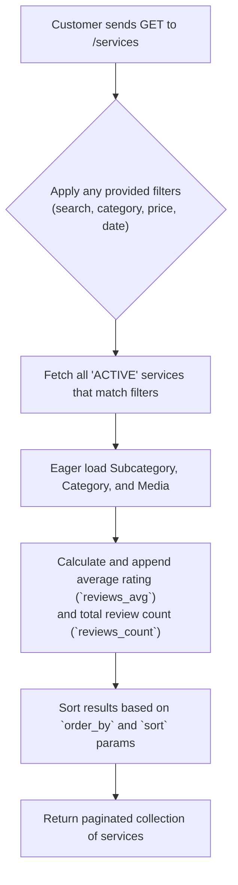
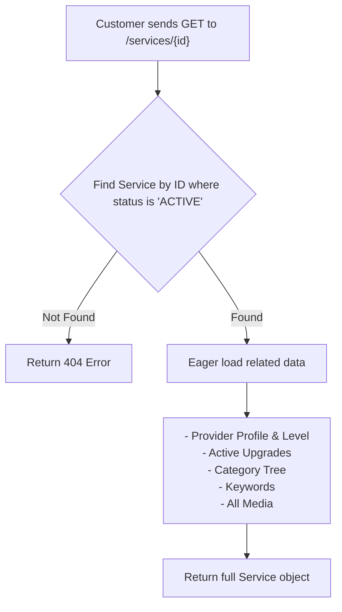

# Service Discovery

This workflow describes how Customers can browse, search, and view services offered on the platform. These endpoints are designed to provide a rich and filterable discovery experience.

---

## 1. List & Filter Services

This endpoint is the main entry point for finding services. It supports pagination, sorting, and a wide variety of filters to help customers narrow down their search.

-   **Endpoint:** `GET /api/v1/services`
-   **Authorization:** Bearer Token (Customer)
-   **Action:** `Customers\Services\IndexServiceAction`

### Process Overview


### Query Parameters

| Field              | Type      | Description                                                    |
| ------------------ | --------- | -------------------------------------------------------------- |
| `search`           | `string`  | A search term to find in service titles.                       |
| `category_id`      | `integer` | Filter by a main category ID.                                  |
| `subcategory_id`   | `integer` | Filter by a subcategory ID. Requires `category_id`.            |
| `price_from`       | `integer` | The minimum price for a service.                               |
| `price_to`         | `integer` | The maximum price for a service.                               |
| `published_at_from`| `date`    | The earliest publication date.                                 |
| `published_at_to`  | `date`    | The latest publication date.                                   |
| `order_by`         | `string`  | Field to sort by. Can be `price`, `published_date`, `reviews_avg`. |
| `sort`             | `string`  | Sort direction. Can be `asc` or `desc`.                        |
| `page`             | `integer` | The page number for pagination.                                |
| `records_per_page` | `integer` | The number of results to return per page.                      |

---

## 2. Show a Single Service

Retrieves the full, detailed information for a single **active** service.

-   **Endpoint:** `GET /api/v1/services/{id}`
-   **Authorization:** Bearer Token (Customer)
-   **Action:** `Customers\Services\ShowServiceAction`

### Process Overview


### Response Body (Example)
A successful response returns a rich service object with all its related data.
```json
{
    "status": "success",
    "message": "Data has been retrieved successfully.",
    "data": {
        "id": 1,
        "title": "Professional Website Design",
        "description": "...",
        "price": "1500.00",
        "media": [
            // ... media objects ...
        ],
        "provider": {
            "id": 12,
            "user": { "profile": { "first_name": "John", "last_name": "Doe" } },
            "providerLevel": { "name_en": "Top Rated" }
        },
        "upgrades": [
            // ... array of active upgrade objects ...
        ],
        "keywords": [
            // ... array of keyword objects ...
        ]
    }
}
```

### Code Highlights & Key Concepts

*   **Conditional Filtering (`->when()`):** The `IndexServiceAction` makes extensive use of Laravel's `when()` method. This allows for clean, readable code where filters are only applied to the database query if they were actually provided in the request. This avoids complex `if/else` chains.
*   **On-the-Fly Aggregates (`withAvg`, `withCount`):** When listing services, the action uses `withAvg` and `withCount` to efficiently calculate the average rating and total number of reviews for each service directly in the database query. This is far more performant than loading the reviews for every service and calculating the values in PHP.
*   **Deep Eager Loading:** The `ShowServiceAction` demonstrates the power of eager loading in Laravel. With a single, well-structured query, it retrieves the service and all of its related data (provider, profile, level, upgrades, categories, media) in a highly efficient way, preventing the "N+1 query problem".
*   **Security Through Status Checks:** Both actions explicitly check for `status = 'ACTIVE'`. This is a critical security measure that ensures customers can only see services that are currently available and approved, preventing access to draft or rejected services.

This concludes the documentation for Service Discovery. 