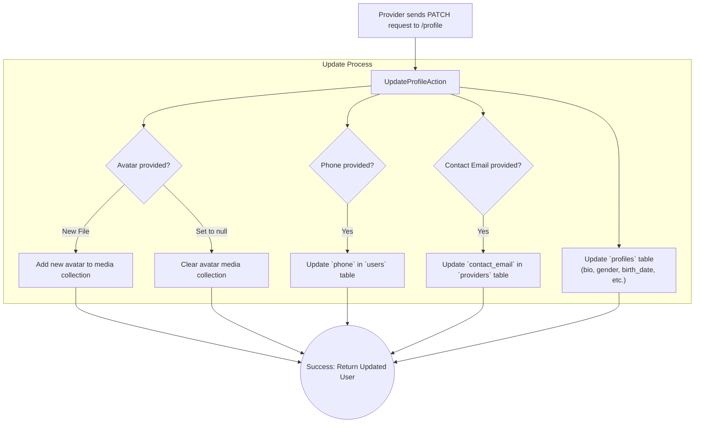

# Profile Management (Provider)

This document describes the provider-specific profile update workflow. For a general overview, see the [Shared Profile Management documentation](../shared/profile-management).

This workflow allows an authenticated provider to update their profile information. The data is distributed across three different tables: `users`, `profiles`, and `providers`.

-   **Endpoint:** `PATCH /api/v1/provider/profile`
-   **Authorization:** Bearer Token (Provider)
-   **Action:** `Providers\Profile\UpdateProfileAction`

---

## Process Overview

The action intelligently updates multiple database tables based on the fields provided in the request.

---

## Request Body

All fields are optional. Only the fields included in the request will be updated.

| Field           | Type         | Rules                      | Description                                                  | Target Table |
| --------------- | ------------ | -------------------------- | ------------------------------------------------------------ | ------------ |
| `bio`           | string       | `sometimes`, `string`      | The provider's biography.                                    | `profiles`   |
| `gender`        | string       | `sometimes`, `in:male,female` | The provider's gender.                                       | `profiles`   |
| `birth_date`    | string       | `sometimes`, `date`        | The provider's date of birth.                                | `profiles`   |
| `nationality_id`| integer      | `sometimes`, `exists:nationalities,id` | The ID of the provider's nationality.                      | `profiles`   |
| `state_id`      | integer      | `sometimes`, `exists:states,id` | The ID of the provider's state.                              | `profiles`   |
| `city_id`       | integer      | `sometimes`, `exists:cities,id` | The ID of the provider's city.                               | `profiles`   |
| `phone`         | string       | `sometimes`                | The provider's phone number.                                 | `users`      |
| `contact_email` | string       | `sometimes`, `email`       | An email address for contact purposes.                       | `providers`  |
| `avatar`        | file or null | `sometimes`                | A new profile picture (jpg/png, max 2MB) or `null` to delete. | `media`      |

---

## Core Logic & Key Concepts

1.  **Selective Updates**: The action uses conditional checks (`if (! $data->field instanceof Optional)`) to ensure it only updates the fields that were actually present in the request data. This makes the endpoint flexible, allowing a provider to update just one piece of information at a time.

2.  **Data Segregation**: The provider's identity is intentionally split across multiple tables (`users` for core auth, `profiles` for public info, `providers` for provider-specific data). The `UpdateProfileAction` correctly handles this by targeting the right table for each piece of data.

3.  **Flexible Media Handling**: The `avatar` field demonstrates a powerful pattern. Sending an `UploadedFile` replaces the existing avatar. Sending `null` explicitly deletes it. Sending nothing leaves it unchanged. This is handled by the Spatie MediaLibrary package. 