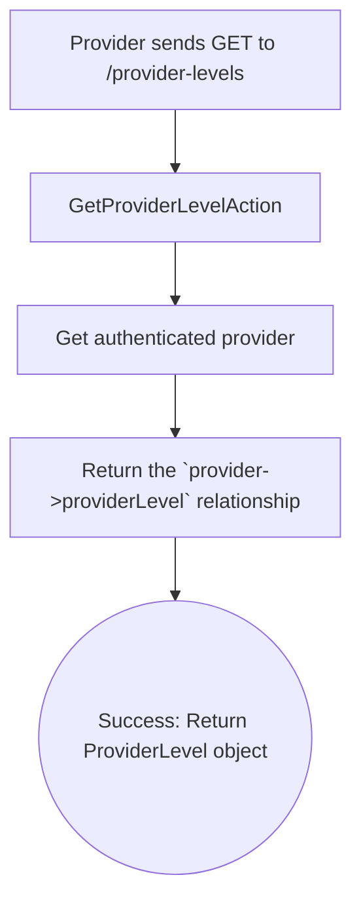

# Provider Levels

This workflow allows a provider to retrieve the details of their current level. The provider's level determines certain limitations and capabilities within the platform, such as the maximum number of services they can create and the maximum price they can set for a service.

-   **Endpoint:** `GET /api/v1/provider/provider-levels`
-   **Authorization:** Bearer Token (Provider)
-   **Action:** `Providers\ProviderLevels\GetProviderLevelAction`

---

## Process Overview

The process is a direct lookup of the provider's assigned level.



---

## Response Body

The response will be a `ProviderLevelResource` object, containing details about the provider's current level.

**Example Response:**
```json
{
    "data": {
        "id": 1,
        "name": "New Provider",
        "service_number": 2,
        "max_service_price": 500
    }
}
```

---

## Core Logic & Key Concepts

1.  **Direct Relationship**: The system is designed so that each `Provider` has a direct `belongsTo` relationship with a `ProviderLevel`. The `GetProviderLevelAction` simply retrieves and returns this already-existing relationship.

2.  **Centralized Rules**: This endpoint is important because it provides the client-side application with the rules the provider must operate under. The frontend can use the `service_number` and `max_service_price` values from this response to validate forms before the user even submits a new service, creating a better user experience.
