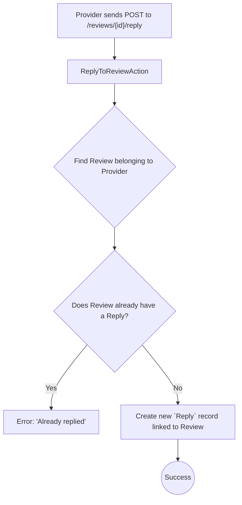

# Review Management

This workflow allows providers to view reviews left for them and their services, and to reply to specific reviews.

---

## 1. List Provider Reviews

Retrieves a paginated list of reviews left directly on the provider's profile.

-   **Endpoint:** `GET /api/v1/provider/reviews`
-   **Authorization:** Bearer Token (Provider)
-   **Action:** `Providers\Reviews\IndexProviderReviewAction`

---

## 2. List Service Reviews

Retrieves a paginated list of reviews for a specific service offered by the provider.

-   **Endpoint:** `GET /api/v1/provider/services/{id}/reviews`
-   **Authorization:** Bearer Token (Provider)
-   **Action:** `Providers\Reviews\IndexServiceReviewAction`

---

## 3. Reply to a Review

Allows a provider to post a single public reply to a review they have received.

-   **Endpoint:** `POST /api/v1/provider/reviews/{id}/reply`
-   **Authorization:** Bearer Token (Provider)
-   **Action:** `Providers\Reviews\ReplyToReviewAction`

### Process Overview

### Request Body
| Field     | Type   | Rules                  | Description                      |
| --------- | ------ | ---------------------- | -------------------------------- |
| `content` | string | `required`, `string`   | The content of the reply.        |

### Core Logic & Key Concepts

1.  **One Reply Per Review**: The most important business rule is enforced by the `if ($review->reply)` check. A provider can only reply **once** to any given review. This prevents spamming or long, drawn-out conversations in the review section.

2.  **Ownership Verification**: The action starts by looking for the review within the scope of the authenticated provider (`$provider->reviews()->findOrFail($review_id)`). This ensures that a provider cannot accidentally (or maliciously) reply to a review that wasn't left for them. 