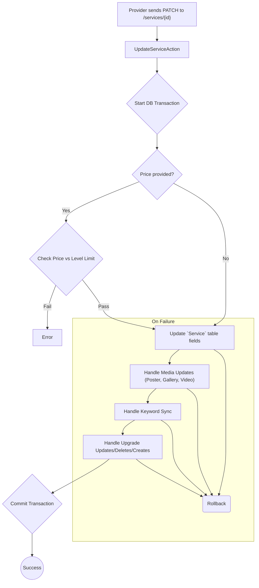

# Service Management

This workflow covers the complete lifecycle of a provider's services, including creation, updating, listing, and deletion.

---

## 1. Create a Service

This endpoint allows a provider to create a new service. The process is comprehensive, handling not only the core service details but also associated skills, keywords, upgrades, and media files, all within a single database transaction.

-   **Endpoint:** `POST /api/v1/provider/services`
-   **Authorization:** Bearer Token (Provider)
-   **Action:** `Providers\Services\StoreServiceAction`

### Process Overview

```mermaid
graph TD;
    A["Provider sends POST to /services"] --> B["StoreServiceAction"];
    B --> C{"Start DB Transaction"};
    C --> D{Provider Level Checks};
    D -- "Fail" --> E[Error: "Max services/price limit reached"];
    D -- "Pass" --> F["Create `Service` record"];
    F --> G["Handle Media (Main Poster, Gallery, Video)"];
    G --> H["Compose & Run `StoreKeywordAction`"];
    H --> I{"Upgrades provided?"};
    I -- "Yes" --> J["Compose & Run `StoreUpgradeAction`"];
    I -- "No" --> K{"Commit Transaction"};
    J --> K;
    K --> L((Success));

    subgraph "On Failure"
        F --> X(Rollback);
        G --> X;
        H --> X;
        J --> X;
    end
```

### Request Body

| Field                   | Type    | Rules                                  | Description                                           |
| ----------------------- | ------- | -------------------------------------- | ----------------------------------------------------- |
| `title`                 | string  | `required`, `string`, `max:100`        | The title of the service.                             |
| `description`           | string  | `required`, `string`, `max:5000`       | A detailed description of the service.                |
| `price`                 | numeric | `required`, `numeric`, `min:1`         | The base price for the service.                       |
| `delivery_time`         | integer | `required`, `integer`, `min:1`         | The number of days required to deliver the service.   |
| `main_poster`           | file    | `required`, `image`, `mimes:jpg,png`, `max:2048` | The primary image for the service.                 |
| `gallery`               | array   | `sometimes`, `array`, `min:1`, `max:5` | An array of additional image files.                   |
| `gallery.*`             | file    | `image`, `mimes:jpg,png`, `max:2048`   | Each gallery image must be a jpg/png under 2MB.       |
| `video`                 | file    | `sometimes`, `mimetypes:video/mp4`, `max:10240` | An optional video for the service (max 10MB).       |
| `old_key_words`         | array   | `sometimes`                            | Array of existing keyword IDs.                        |
| `new_key_words`         | array   | `sometimes`                            | Array of new keyword strings to create.               |
| `upgrades`              | array   | `sometimes`, `array`                   | Optional upgrades for the service.                    |
| `upgrades.*.title`      | string  | `required`                             | Title of the upgrade.                                 |
| `upgrades.*.price`      | numeric | `required`                             | Additional price for the upgrade.                     |
| `upgrades.*.delivery_time`| integer | `required`                             | Additional delivery time for the upgrade (days).      |

### Core Logic & Key Concepts

1.  **Provider Level Restrictions**: Before creating a service, the action verifies two things against the provider's current level:
    *   **Service Count**: Ensures the provider has not exceeded the maximum number of allowed services.
    *   **Price Cap**: Ensures the service price is not higher than the maximum allowed for their level.

2.  **Action Composition**: Similar to the `SetupAction`, the `StoreServiceAction` delegates work to more specialized actions (`StoreKeywordAction`, `StoreUpgradeAction`). This keeps the code clean, organized, and promotes reusability.

3.  **Transactional Integrity**: The entire operation is wrapped in a `DB::transaction()`. This is critical because creating a service involves multiple database insertions (the service itself, keywords, upgrades, media). The transaction guarantees that if any part of this complex process fails (e.g., an invalid keyword), the entire set of changes is rolled back, preventing orphaned data.

---

## 2. Update a Service

This endpoint allows a provider to update an existing service. It handles partial updates, meaning you only need to send the fields you want to change. It also provides granular control over associated data like keywords and upgrades.

-   **Endpoint:** `PATCH /api/v1/provider/services/{id}`
-   **Authorization:** Bearer Token (Provider)
-   **Action:** `Providers\Services\UpdateServiceAction`

### Process Overview



### Request Body

All fields are optional.

| Field                   | Type    | Description                                                     |
| ----------------------- | ------- | --------------------------------------------------------------- |
| `title`                 | string  | The new title of the service.                                   |
| `description`           | string  | The new description of the service.                             |
| `price`                 | numeric | The new base price for the service.                             |
| ...                     | ...     | *(Other service fields like delivery_time, etc.)*               |
| `main_poster`           | file    | A new main poster file to replace the old one.                  |
| `gallery`               | array   | An array of new images. **Replaces the entire gallery.**        |
| `video`                 | file/null| A new video file, or `null` to delete the existing video.     |
| `old_key_words` / `new_key_words` | array | Arrays to sync the service's keywords.                    |
| `upgrades_edit`         | array   | Array of upgrade objects with `id` to update existing upgrades. |
| `upgrades_delete`       | array   | Array of upgrade `id`s to delete.                               |
| `upgrades`              | array   | Array of new upgrade objects to create.                         |

### Core Logic & Key Concepts

1.  **Granular Upgrade Control**: Unlike some simpler update actions, the `UpdateServiceAction` provides three distinct keys for managing upgrades (`upgrades_edit`, `upgrades_delete`, `upgrades`), allowing for precise and efficient modifications without needing to resubmit the entire list.

2.  **"Full Replacement" for Gallery**: It's important to note that updating the `gallery` is a "full replacement" operation. The action first clears the entire existing gallery and then adds the new images. This differs from a simple additive update.

3.  **Conditional Logic**: The action is filled with conditional checks (`if (! $data->field instanceof Optional)`) to ensure it only performs work for the data that was actually sent in the `PATCH` request, making it highly efficient for small updates.

---

## 3. List Services

Retrieves a paginated list of the authenticated provider's services.

-   **Endpoint:** `GET /api/v1/provider/services`
-   **Authorization:** Bearer Token (Provider)
-   **Action:** `Providers\Services\IndexServiceAction`

---

## 4. Show a Service

Retrieves the details of a single service belonging to the provider.

-   **Endpoint:** `GET /api/v1/provider/services/{id}`
-   **Authorization:** Bearer Token (Provider)
-   **Action:** `Providers\Services\ShowServiceAction`

---

## 5. Delete a Service

Deletes a service belonging to the provider. This is a soft delete.

-   **Endpoint:** `DELETE /api/v1/provider/services/{id}`
-   **Authorization:** Bearer Token (Provider)
-   **Action:** `Providers\Services\DeleteServiceAction` 