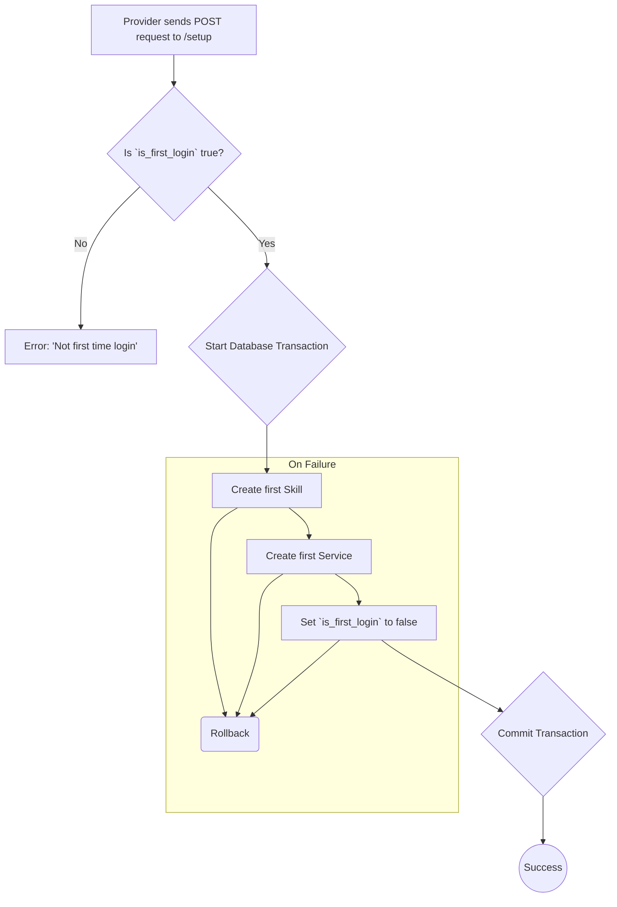

# Provider Setup

This workflow is a crucial, one-time process for a new provider after their first login. It allows them to create their initial [skill](./skill-management) and [service](./service-management) in a single, atomic transaction.

-   **Endpoint:** `POST /api/v1/provider/setup`
-   **Authorization:** Bearer Token (Provider)
-   **Action:** `Providers\Setup\SetupAction`

---

## Process Overview

The setup process is designed to ensure a provider's profile is populated with at least one skill and service right from the start.

---

## Request Body

The request must contain all the necessary information to create both a skill and a service.

| Field                   | Type    | Rules                                  | Description                                           |
| ----------------------- | ------- | -------------------------------------- | ----------------------------------------------------- |
| `skills`                | array   | `required`, `array`, `min:1`           | An array containing the IDs of the skills to add.     |
| `title`                 | string  | `required`, `string`, `max:100`        | The title of the initial service.                     |
| `description`           | string  | `required`, `string`, `max:5000`       | A detailed description of the service.                |
| `price`                 | numeric | `required`, `numeric`, `min:1`         | The base price for the service.                       |
| `delivery_time`         | integer | `required`, `integer`, `min:1`         | The number of days required to deliver the service.   |
| `images`                | array   | `sometimes`, `array`, `min:1`, `max:5` | An array of image files for the service.              |
| `images.*`              | file    | `image`, `mimes:jpg,png`, `max:2048`   | Each image must be a jpg/png under 2MB.               |
| `upgrades`              | array   | `sometimes`, `array`                   | Optional upgrades for the service.                    |
| `upgrades.*.title`      | string  | `required`, `string`                   | The title of the upgrade.                             |
| `upgrades.*.price`      | numeric | `required`, `numeric`                  | The additional price for the upgrade.                 |
| `upgrades.*.delivery_time`| integer | `required`, `integer`                | Additional delivery time for the upgrade (in days). |

---

## Core Logic & Key Concepts

1.  **First-Time Gate**: The entire process is guarded by the `is_first_login` flag on the `Provider` model. This ensures this specific setup flow can only ever be executed once.

2.  **Transactional Integrity**: The creation of the skill, the service, and the update of the provider's login status are all wrapped in a `DB::transaction()`. This guarantees that a provider will not be left in an inconsistent state (e.g., having a service but no skill, or having their `is_first_login` flag changed without the service being created).

3.  **Action Composition**: The `SetupAction` does not contain the logic for creating skills or services itself. Instead, it acts as a composer, invoking the dedicated `StoreSkillAction` and `StoreServiceAction`. This is a clean design pattern that promotes reusability and separation of concerns. For more details on how these work individually, see the [Skill Management](./skill-management) and [Service Management](./service-management) documentation.
