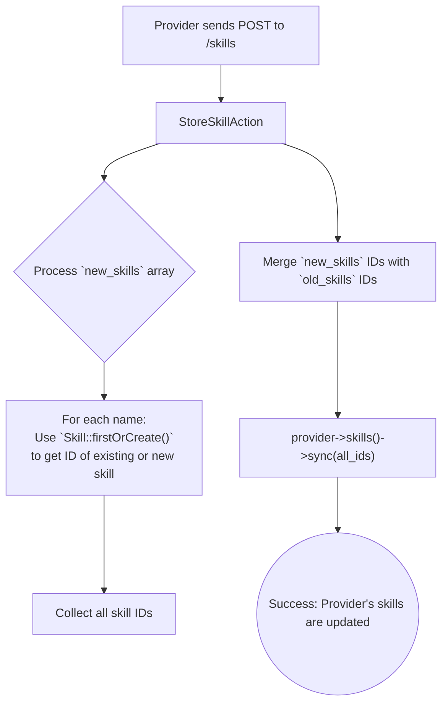

# Skill Management

This workflow allows providers to manage the skills associated with their profile. They can list all skills available on the platform and update their personal list of skills.

---

## 1. List All Skills

Providers can retrieve a list of all skills available in the system.

-   **Endpoint:** `GET /api/v1/provider/skills`
-   **Authorization:** Bearer Token (Provider)
-   **Action:** `Providers\Skills\IndexSkillAction`

---

## 2. Update Provider's Skills

This endpoint allows a provider to set or update their list of skills. It intelligently handles both existing skills and new, user-defined skills.

-   **Endpoint:** `POST /api/v1/provider/skills`
-   **Authorization:** Bearer Token (Provider)
-   **Action:** `Providers\Skills\StoreSkillAction`

### Process Overview

The `StoreSkillAction` takes a list of new skill names and existing skill IDs and synchronizes them with the provider's profile.

### Request Body

| Field        | Type  | Rules                | Description                                                |
| ------------ | ----- | -------------------- | ---------------------------------------------------------- |
| `old_skills` | array | `sometimes`, `array` | An array of numeric IDs for existing skills.               |
| `old_skills.*`| int   | `exists:skills,id`   | Each ID must correspond to a skill in the `skills` table.  |
| `new_skills` | array | `sometimes`, `array` | An array of strings for new skills to be created.          |
| `new_skills.*`| string| `string`, `distinct` | Each new skill name must be unique within the request.     |

### Core Logic & Key Concepts

1.  **`firstOrCreate` for Efficiency**: The action uses `Skill::firstOrCreate()` to handle the `new_skills`. This is highly efficient as it avoids duplicate skill entries in the main `skills` table. If a provider adds a skill that another provider has already created (e.g., "Graphic Design"), the system reuses the existing record instead of making a new one.

2.  **`sync()` for Synchronization**: The `sync()` method is the key to this operation. Instead of manually attaching and detaching skills, `sync()` takes a complete list of the skills the provider *should* have. It then automatically calculates the difference:
    *   It **detaches** any skills the provider was previously linked to but are not in the new list.
    *   It **attaches** any skills from the new list that the provider wasn't linked to before.
    *   It **leaves** any existing links that are still valid.
    This makes the update process atomic and reliable. 