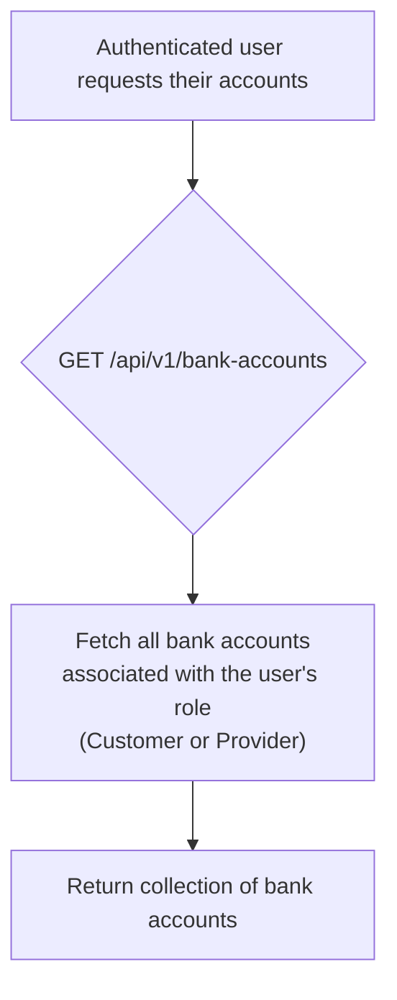
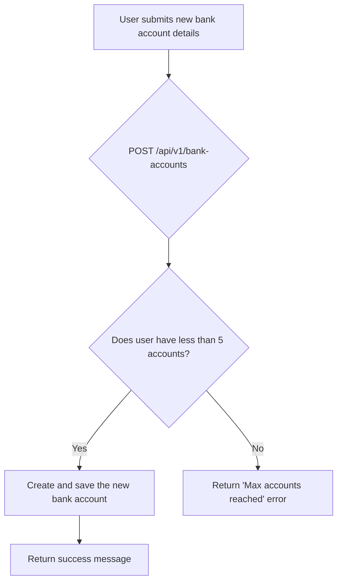
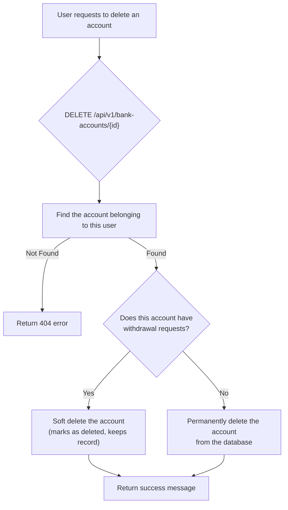

# Bank Accounts

This workflow covers how both Customers and Providers can manage their bank accounts. These accounts are used to receive funds via [Withdrawal Requests](./withdrawal-requests). All endpoints in this workflow require authentication.

---

## Flow Diagrams

### List Bank Accounts


### Store Bank Account


### Delete Bank Account


---

## 1. List Bank Accounts

Retrieves a list of all bank accounts associated with the authenticated user (Customer or Provider).

-   **Endpoint:** `GET /api/v1/bank-accounts`
-   **Method:** `GET`
-   **Authentication:** Required (Customer or Provider Token)

### Success Response (200 OK)
Returns an array of the user's bank account objects.
```json
{
    "message": "Data retrieved successfully.",
    "data": [
        {
            "id": 1,
            "bank_name": "Al-Rajhi Bank",
            "account_number": "SA1234567890123456789012",
            "holder_name": "Khalid Ghanim"
        }
    ]
}
```

---

## 2. Store Bank Account

Adds a new bank account for the authenticated user.

-   **Endpoint:** `POST /api/v1/bank-accounts`
-   **Method:** `POST`
-   **Authentication:** Required (Customer or Provider Token)

### Request Body
| Parameter        | Type   | Rules                                           |
| ---------------- | ------ | ----------------------------------------------- |
| `bank_name`      | string | Required, max 255 characters.                   |
| `account_number` | string | Required, must be a unique IBAN format.         |
| `holder_name`    | string | Required, max 255 characters.                   |

### Success Response (200 OK)
```json
{
    "message": "Bank account created successfully."
}
```

### Error Response (422 Unprocessable Entity)
- If the user already has 5 or more bank accounts.

---

## 3. Delete Bank Account

Deletes a specific bank account by its ID.

-   **Endpoint:** `DELETE /api/v1/bank-accounts/{id}`
-   **Method:** `DELETE`
-   **Authentication:** Required (Customer or Provider Token)

### URL Parameters
| Parameter | Type    | Description                       |
| --------- | ------- | --------------------------------- |
| `id`      | integer | The ID of the bank account to delete. |

### Success Response (200 OK)
```json
{
    "message": "Bank account deleted successfully."
}
```

### Error Response (404 Not Found)
- If the `id` does not correspond to a bank account owned by the authenticated user.

---

### Code Highlights & Key Concepts

1.  **Polymorphic Relationship**: The `bankAccounts()` method is a polymorphic relationship defined on both the `Customer` and `Provider` models. This allows the same `IndexBankAccountAction` to work for both user types without any conditional logic. It simply calls `$user->bankAccounts()` on the authenticated user, and Laravel figures out whether to fetch accounts for a customer or a provider.

2.  **Business Rule Enforcement (`StoreBankAccountAction`)**: This action enforces a clear business rule: a user cannot have more than 5 bank accounts. It performs a quick check (`->count() >= 5`) before attempting to create a new account and throws a custom `LogicalException` with a user-friendly message if the limit is reached.

3.  **Conditional Deletion (`DeleteBankAccountAction`)**: This action contains critical logic to preserve data integrity. Instead of simply deleting the account, it first checks if the account is associated with any `withdrawalRequests`.
    -   If **yes**, it performs a **soft delete** (`$account->delete()`). This keeps the record in the database but marks it as "deleted," so it no longer appears in lists. This is crucial for maintaining historical records of past withdrawals.
    -   If **no**, it performs a **force delete** (`$account->forceDelete()`), permanently removing the record from the database to save space.
This conditional approach is an excellent way to handle data retention rules.
