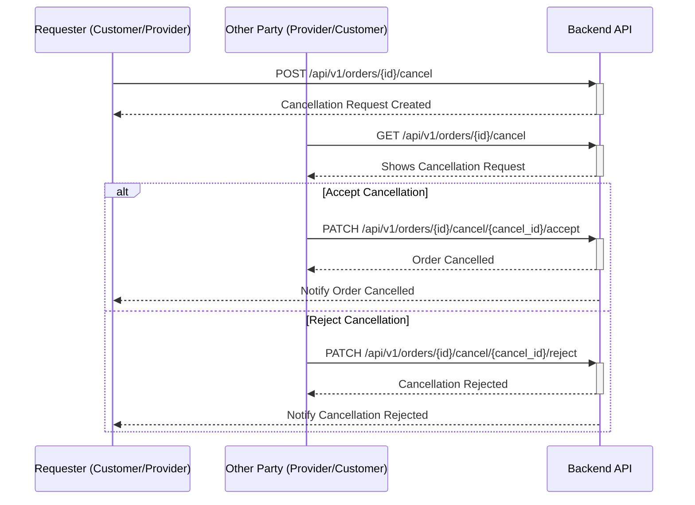

## Order Cancellation Workflow

The order cancellation process allows either the customer or the provider to request the cancellation of an order. The other party must then accept or reject the cancellation request.

### Roles

*   **Customer**: The user who created the order.
*   **Provider**: The user who is fulfilling the order.

### Cancellation Flow Diagram

## API Endpoints

The following endpoints are used to manage order cancellations. These endpoints are accessible to both **customers** and **providers**. The system uses the authenticated user's role to manage the state machine appropriately.

### 1. Initiate a Cancellation Request

A user (customer or provider) can request to cancel an order.

*   **Endpoint**: `POST /api/v1/orders/{id}/cancel`
*   **Description**: Creates a new cancellation request for the specified order.
*   **`{id}`**: The ID of the order to be cancelled.

### 2. View Cancellation Requests

Either party can view the cancellation requests associated with an order.

*   **Endpoint**: `GET /api/v1/orders/{id}/cancel`
*   **Description**: Retrieves all cancellation requests for the specified order.
*   **`{id}`**: The ID of the order.

### 3. Accept a Cancellation Request

The party that did not initiate the cancellation must approve the request.

*   **Endpoint**: `PATCH /api/v1/orders/{id}/cancel/{cancel_id}/accept`
*   **Description**: Accepts a specific cancellation request. If accepted, the order status is changed to `CANCELLED`, and any funds held in escrow are returned.
*   **`{id}`**: The ID of the order.
*   **`{cancel_id}`**: The ID of the cancellation request to accept.

### 4. Reject a Cancellation Request

The party that did not initiate the cancellation can also reject the request.

*   **Endpoint**: `PATCH /api/v1/orders/{id}/cancel/{cancel_id}/reject`
*   **Description**: Rejects a specific cancellation request. The order returns to its previous state.
*   **`{id}`**: The ID of the order.
*   **`{cancel_id}`**: The ID of the cancellation request to reject. 