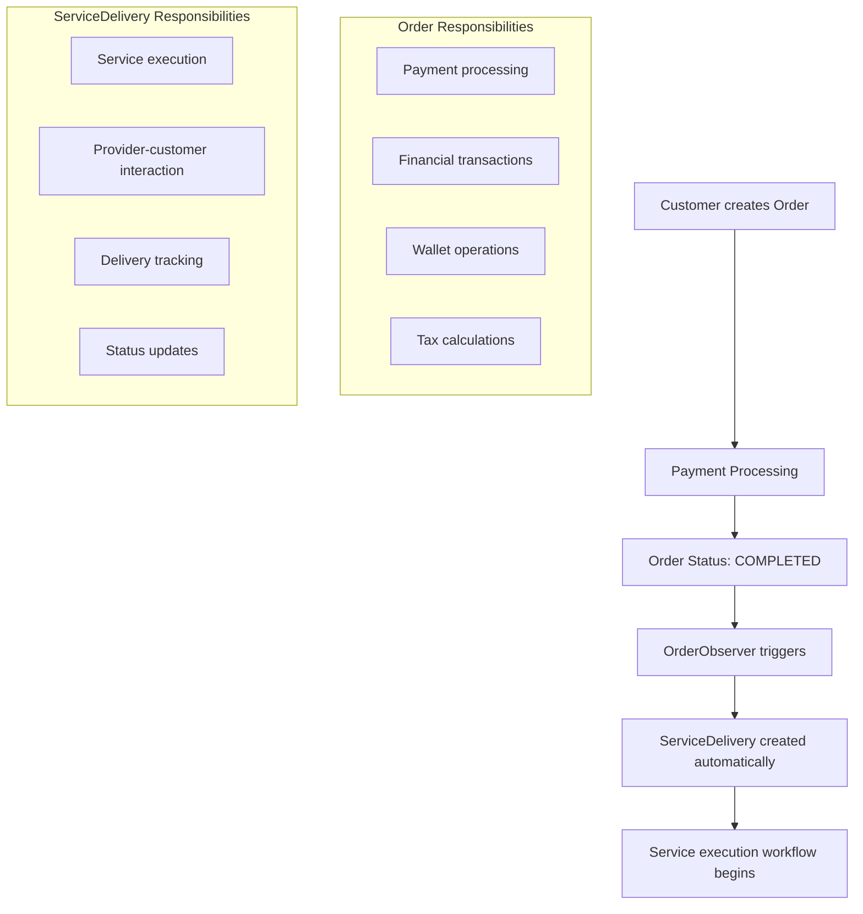
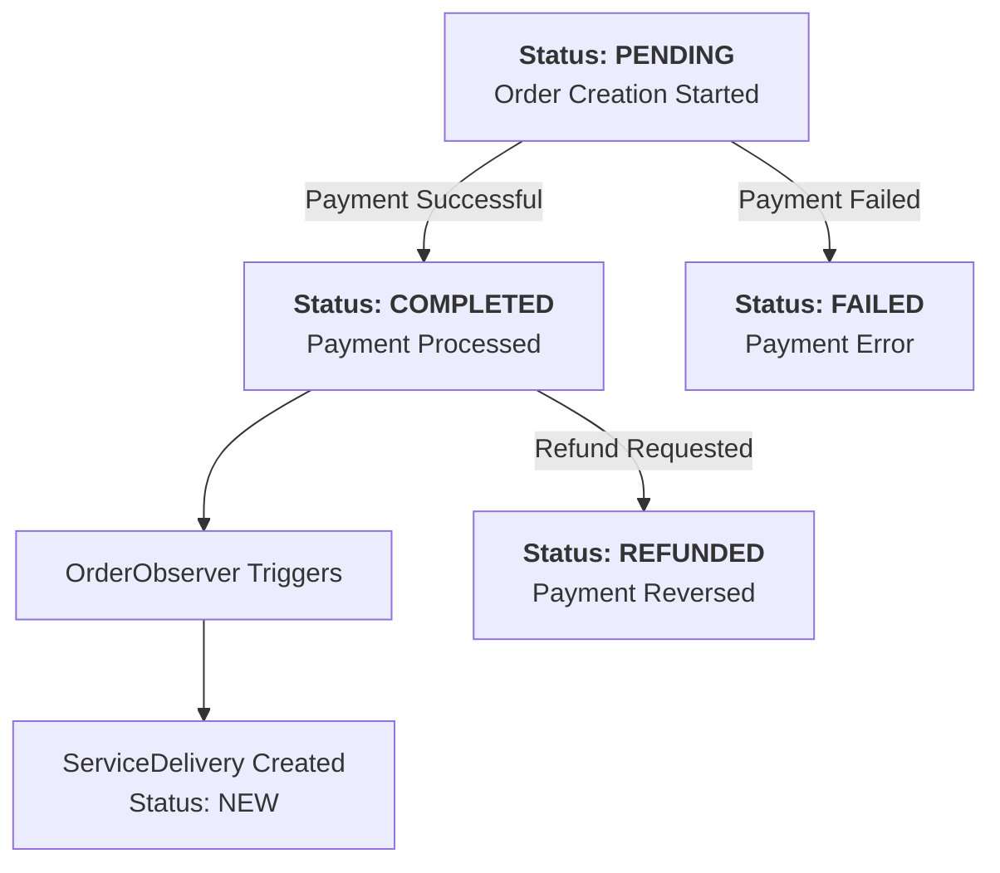
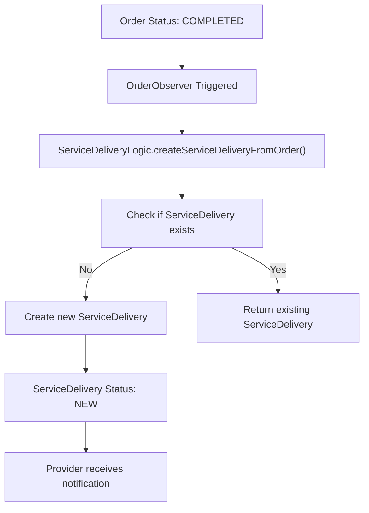
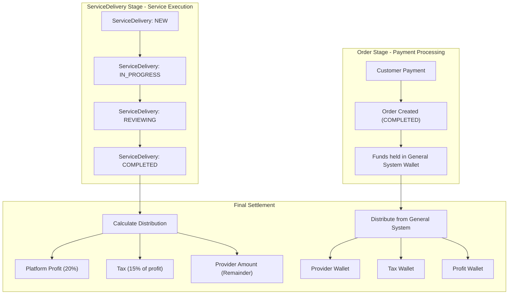

# Order Management

This document outlines the payment and financial aspects of orders in the Brooder platform. **Important:** In the updated system, Orders handle payment processing only. Once an order is successfully paid, the system automatically creates a ServiceDelivery for the actual service execution workflow.

---

## Order vs ServiceDelivery: System Architecture

The Brooder platform separates financial operations from service execution:

---

## Order Lifecycle: Payment Focus

An order has a simplified lifecycle focused on payment states:

---

## The Order Creation Process

### Step 1: Customer Creates and Pays for Order

The order creation process is entirely focused on payment processing:

-   **Endpoint:** `POST /api/v1/customer/orders`
-   **Status Flow:** `(None)` -> **`COMPLETED`** (on successful payment)

**Process Flow:**
1.  The system validates the requested service and upgrades.
2.  A database transaction begins.
3.  Total price and tax are calculated.
4.  Payment method is processed (wallet, credit card, etc.).
5.  If payment succeeds, order is created with status `COMPLETED`.
6.  The transaction is committed.
7.  `OrderObserver` automatically creates a `ServiceDelivery` with status `NEW`.

### Step 2: Automatic ServiceDelivery Creation

When an order reaches `COMPLETED` status, the system automatically:

**ServiceDelivery Creation Details:**
- Copies service information from the order
- Links to the service provider
- Sets initial status to `NEW`
- Includes delivery time and requirements

---

## Financial Settlement: The Complete Flow

The financial settlement now happens at the ServiceDelivery completion stage, not at order completion:

---

## Order Status Reference

| Status | Description | Trigger |
|--------|-------------|---------|
| `PENDING` | Payment is being processed | During payment processing |
| `COMPLETED` | Payment successful, funds in escrow | Successful payment |
| `FAILED` | Payment failed | Payment processing error |
| `REFUNDED` | Payment refunded to customer | Refund processing |

---

## Key Differences from Previous System

### Before (Old System)
- Orders handled both payment and service execution
- Complex status management mixing financial and execution states
- Order completion triggered financial settlement

### After (New System)
- **Orders**: Pure payment processing
- **ServiceDeliveries**: Pure service execution
- Clear separation of concerns
- Financial settlement happens at ServiceDelivery completion

---

## Code Highlights & Key Concepts

1.  **Observer Pattern**: `OrderObserver` automatically creates ServiceDeliveries when orders are completed
2.  **Atomic Payment Processing**: Order creation with payment is wrapped in `DB::transaction()`
3.  **Escrow System**: Successful payments are held in `General System` wallet until service completion
4.  **Separation of Concerns**: Financial operations are completely separate from service execution
5.  **Automatic Workflow Transition**: Orders seamlessly transition to ServiceDelivery workflow

For service execution workflows, see the [ServiceDelivery Management documentation](./service-delivery-management.md).
