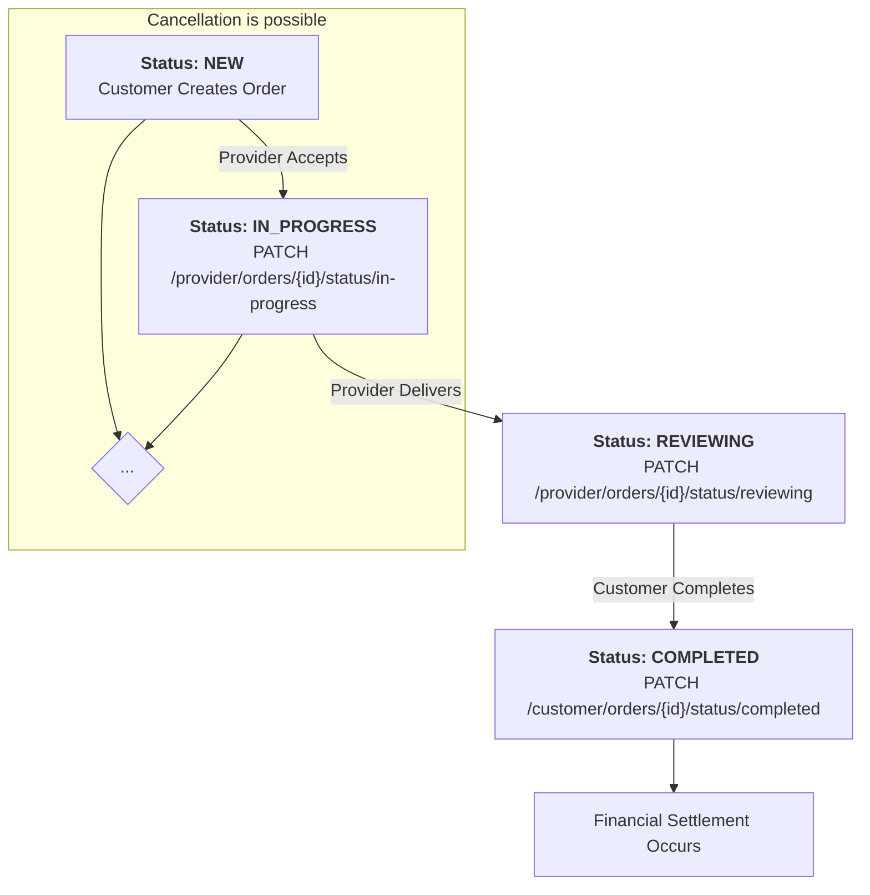
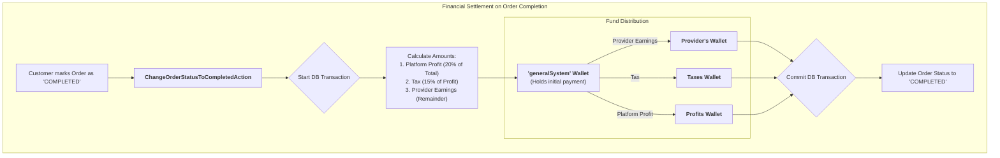
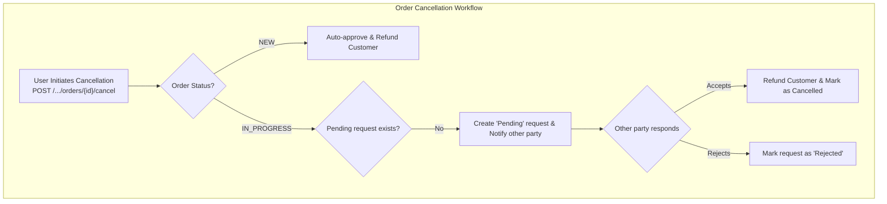

# Order Management

This document outlines the complete lifecycle of an order, from creation by a customer to completion and potential cancellation. It details the state changes and the roles responsible for each step.

---

## The Order Lifecycle: A High-Level View

An order progresses through several states, with actions from both the Customer and the Provider driving it forward. This diagram illustrates the primary path an order takes from creation to completion.

---

## Common Action: Listing Orders

At any point in the lifecycle, both customers and providers can retrieve a list of their orders.

-   **Endpoint:** `GET /api/v1/{user_type}/orders`
-   **`user_type`:** `customer` or `provider`
-   **Description:** Retrieves a paginated list of orders for the authenticated user. Supports filtering by status and sorting.
-   **Controller:** `Shared\Orders\IndexOrderController`
-   **Action:** `Shared\Orders\IndexOrderAction`

---

## The Primary Workflow: From Creation to Completion

This section details the step-by-step "happy path" of an order.

### Step 1 (Customer): Create an Order

A customer initiates the process. This is a transactional process that ensures the order is only created if the payment succeeds. For more details on the request body and process, see the [Customer: Order Management documentation](../customer/order-management).

-   **Endpoint:** `POST /api/v1/customer/orders`
-   **Status Change:** `(None)` -> **`NEW`**

**Process Flow:**
1.  The system validates the requested service and upgrades.
2.  A database transaction begins.
3.  An order record is created with the status `NEW`.
4.  The customer's wallet is charged, and funds are moved to a central holding wallet (`generalSystem`).
5.  The transaction is committed. If any step fails, it is rolled back.

### Step 2 (Provider): Manage the Order

-   **A. Accept Order**: The provider accepts the work.
    -   **Endpoint**: `PATCH /api/v1/provider/orders/{id}/status/in-progress`
    -   **Status Change:** `NEW` -> **`IN_PROGRESS`**
-   **B. Deliver Order**: The provider completes the work and submits it for review.
    -   **Endpoint**: `PATCH /api/v1/provider/orders/{id}/status/reviewing`
    -   **Status Change:** `IN_PROGRESS` -> **`REVIEWING`**

### Step 3 (Customer): Complete the Order & Trigger Financial Settlement

The customer reviews the delivered work and marks the order as complete, which triggers the financial distribution. For a detailed look at the financial settlement process, see the [Customer: Order Management documentation](../customer/order-management).

-   **Endpoint**: `PATCH /api/v1/customer/orders/{id}/status/completed`
-   **Status Change:** `REVIEWING` -> **`COMPLETED`**

#### Financial Settlement Workflow
This atomic process distributes the funds from the central holding wallet.

---

## Alternative Workflow: Order Cancellation

If things don't go as planned, either the customer or provider can initiate a cancellation. This process is state-dependent.

### Detailed Cancellation Logic

This workflow is handled by three main actions: `StoreCancelOrderAction`, `AcceptCancelOrderAction`, and `RejectCancelOrderAction`.

#### Scenario 1: Cancelling a 'NEW' Order
When a user cancels an order that is still `NEW`, the process is immediate.
1.  **Instant Approval**: The system sees the order is `NEW`, so it immediately marks the order as `is_cancelled = true`.
2.  **Record Creation**: A `CancelOrder` record is created with a status of `APPROVED`.
3.  **Full Refund**: The system instantly transfers the full `total_price` from the central holding wallet back to the customer's wallet.

#### Scenario 2: Requesting to Cancel an 'IN_PROGRESS' Order
If the order is `IN_PROGRESS`, a request/response flow begins.
1.  **Check for Duplicates**: The system first checks if another `PENDING` cancellation request already exists to prevent duplicates.
2.  **Create Pending Request**: A `CancelOrder` record is created with a status of `PENDING`. The record stores who is making the request and who needs to respond.
3.  **Await Response**: The order remains `IN_PROGRESS` while waiting for the other party to accept or reject.

#### Scenario 3: Accepting a Cancellation Request
When the receiving party agrees to cancel.
1.  **Update Request**: The `CancelOrder` status is changed from `PENDING` to `APPROVED`.
2.  **Cancel Order**: The original order is now marked as `is_cancelled = true`.
3.  **Full Refund**: The customer is refunded the `total_price` from the central holding wallet.

#### Scenario 4: Rejecting a Cancellation Request
When the receiving party does not agree to cancel.
1.  **Update Request**: The `CancelOrder` status is simply changed from `PENDING` to `REJECTED`.
2.  **No Other Changes**: The order remains `IN_PROGRESS`, and no funds are moved. The workflow is expected to continue.

### Cancellation Workflow Diagram

#### Endpoints
1.  **Request Cancellation**: `POST /api/v1/{user_type}/orders/{id}/cancel`
2.  **View Requests**: `GET /api/v1/{user_type}/orders/{id}/cancel`
3.  **Accept Request**: `PATCH /api/v1/{user_type}/orders/{id}/cancel/{cancel_id}/accept`
4.  **Reject Request**: `PATCH /api/v1/{user_type}/orders/{id}/cancel/{cancel_id}/reject`

---

## Code Highlights & Key Concepts

1.  **Atomic Operations**: Both order creation (`StoreOrderAction`) and financial settlement (`ChangeOrderStatusToCompletedAction`) are wrapped in `DB::transaction()`. This ensures the platform's financial integrity.
2.  **State Machine Enforcement**: Actions include prerequisite checks (e.g., must be `REVIEWING` to be `COMPLETED`). This prevents invalid state transitions and ensures a robust lifecycle.
3.  **Central Holding Wallet**: Using a temporary `generalSystem` wallet decouples customer payment from final settlement, enabling complex distributions and simplifying refunds.
4.  **Conditional Cancellation Logic**: The system intelligently handles cancellations based on the order's state (immediate for `NEW` vs. a request/response flow for `IN_PROGRESS`).
