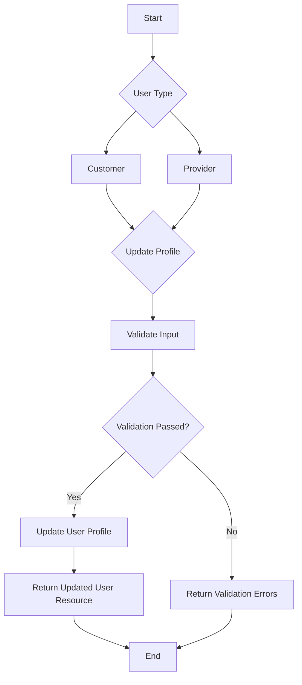

# Profile Management

The Profile Management workflow allows both Customers and Providers to manage their personal information. While most profile attributes are shared, Providers have some additional fields they can modify.

## Endpoints

### Update Profile

This endpoint allows users to update their profile information.

*   **Endpoint:** `PATCH /api/v1/profile`
*   **Authorization:**
    *   Bearer Token (Customer)
    *   Bearer Token (Provider)
*   **Action:**
    *   `Customers\Profile\UpdateProfileController`
    *   `Providers\Profile\UpdateProfileController`

## Process Flow



## Request Body

### Shared Fields (Customer & Provider)

| Field            | Type     | Description                                     | Rules                                                                |
| ---------------- | -------- | ----------------------------------------------- | -------------------------------------------------------------------- |
| `first_name`     | `string` | The user's first name.                          | `required`, `min:2`, `max:50`, `regex:/^[\p{Arabic}A-Za-z ]+$/u`      |
| `last_name`      | `string` | The user's last name.                           | `required`, `min:2`, `max:50`, `regex:/^[\p{Arabic}A-Za-z ]+$/u`      |
| `gender`         | `string` | The user's gender. Must be one of `male` or `female`. | `required`, `in:male,female`                                         |
| `avatar`         | `file`   | A new avatar image for the user.                | `nullable`, `mimes:png,jpg,jpeg`, `max:2048KB`                        |
| `city_id`        | `integer`| The ID of the user's city.                      | `required`, `exists:cities,id`                                       |
| `nationality_id` | `integer`| The ID of the user's nationality.               | `required`, `exists:nationalities,id`                                |

### Provider-Specific Fields

In addition to the shared fields, Providers can update the following:

| Field             | Type     | Description                                     | Rules                                                                |
| ----------------- | -------- | ----------------------------------------------- | -------------------------------------------------------------------- |
| `contact_email`   | `string` | The provider's contact email address.           | `required`, `email`, `unique:providers,contact_email`                |
| `phone_country`   | `string` | The country code for the phone number.          | `required_with:phone`, `exists:countries,code`                       |
| `phone`           | `string` | The provider's phone number.                    | `required`, `regex:/^\d+$/`, `digits_between:8,15`, `unique:users,phone`, `phone` |

## Responses

### Success Response (`200 OK`)

```json
{
    "status": "success",
    "message": "Data has been updated successfully.",
    "data": {
        "id": 1,
        "first_name": "John",
        "last_name": "Doe",
        "email": "john.doe@example.com",
        "phone": "1234567890",
        "avatar": "https://example.com/avatar.jpg",
        // ... other user fields
    }
}
```

### Error Response (`422 Unprocessable Entity`)

If validation fails, the response will contain the validation errors.

```json
{
    "message": "The given data was invalid.",
    "errors": {
        "first_name": [
            "The first name must be at least 2 characters."
        ]
    }
}
```

## Code Highlights & Key Concepts

*   **Separate Controllers, Shared Logic:** While there are two distinct controllers (`Customers\Profile\UpdateProfileController` and `Providers\Profile\UpdateProfileController`), they both handle the core logic of updating a user's profile. This separation allows for customized validation and logic for each user type.
*   **Form Requests for Validation:** Both controllers leverage Form Request classes (`UpdateProfileRequest`) to handle validation. This keeps the controllers clean and centralizes validation logic.
*   **Provider-Specific Validation:** The `Providers\Profile\UpdateProfileRequest` includes validation rules for fields that are unique to providers, such as `contact_email` and `phone`. This demonstrates how the system can enforce different data requirements for different user roles.
*   **Action Classes:** The actual profile update logic is encapsulated within Action classes (`UpdateProfileAction`). This is a good practice for separating business logic from the HTTP layer (controllers).
*   **DTOs (Data Transfer Objects):** The validated request data is converted into a `UpdateProfileData` DTO. This ensures that the action class receives a structured, predictable object to work with.

This concludes the documentation for the shared Profile Management workflow.
