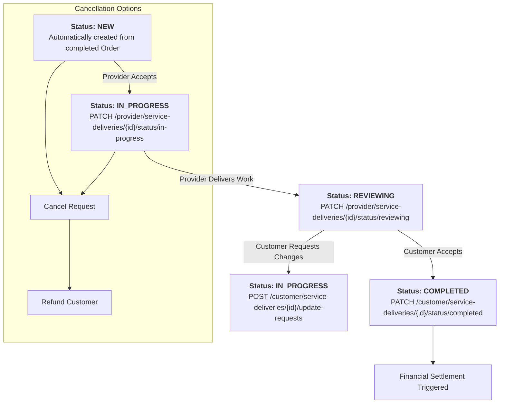
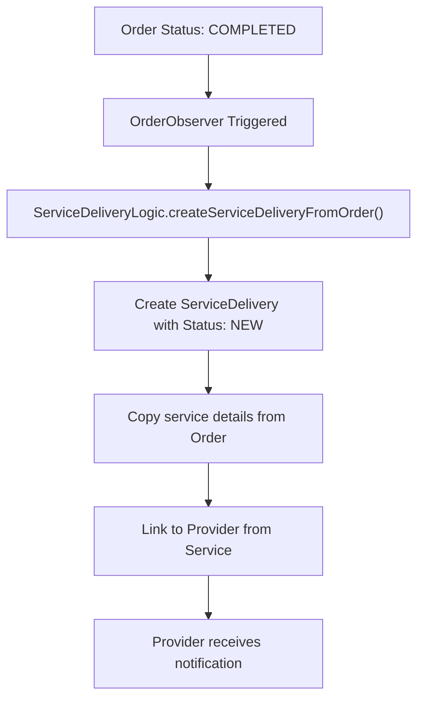
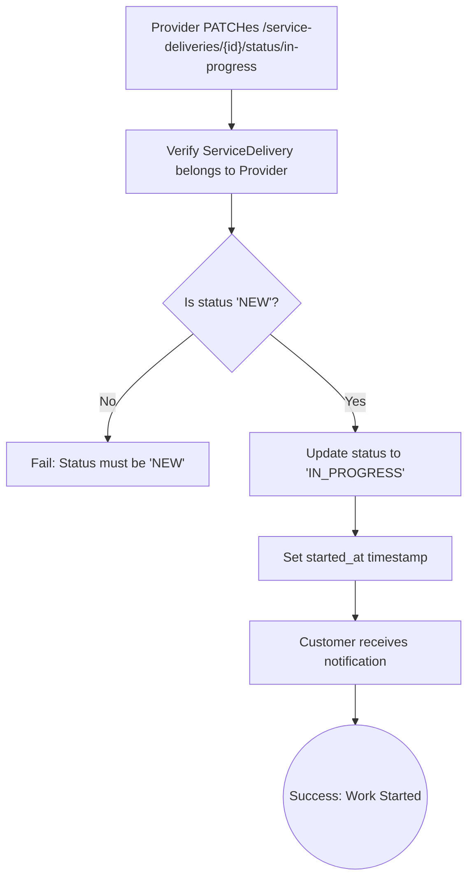
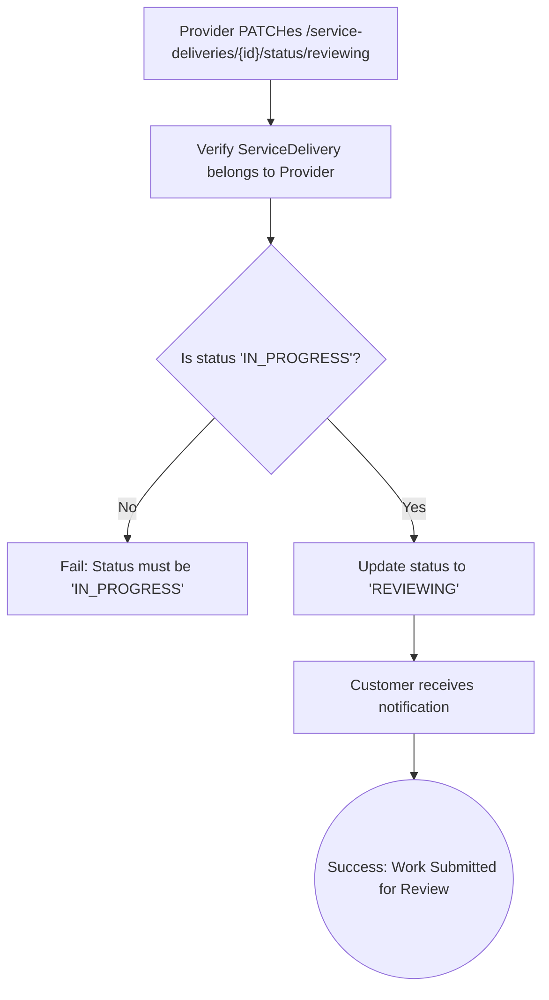
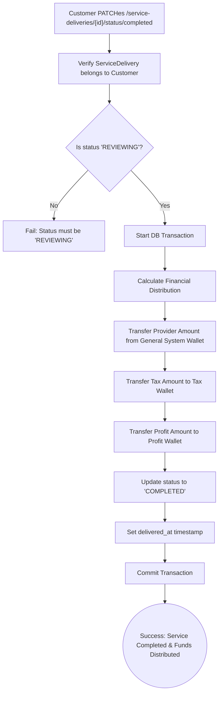
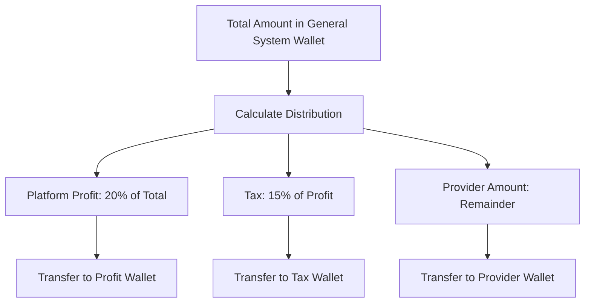
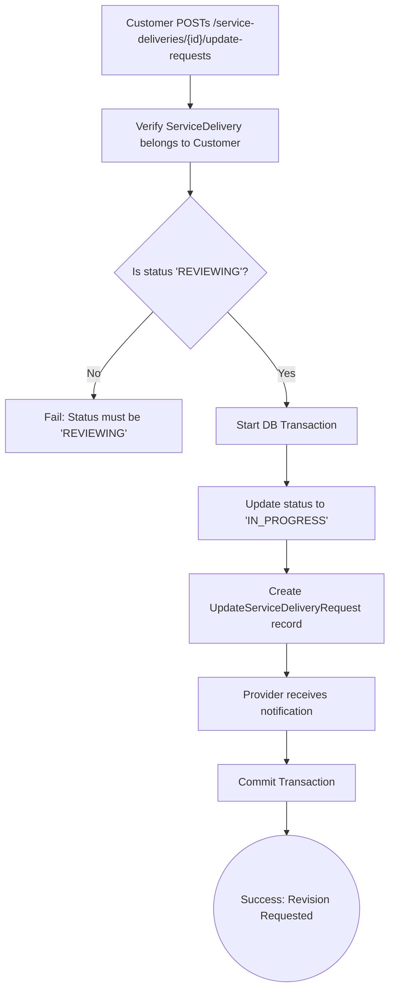
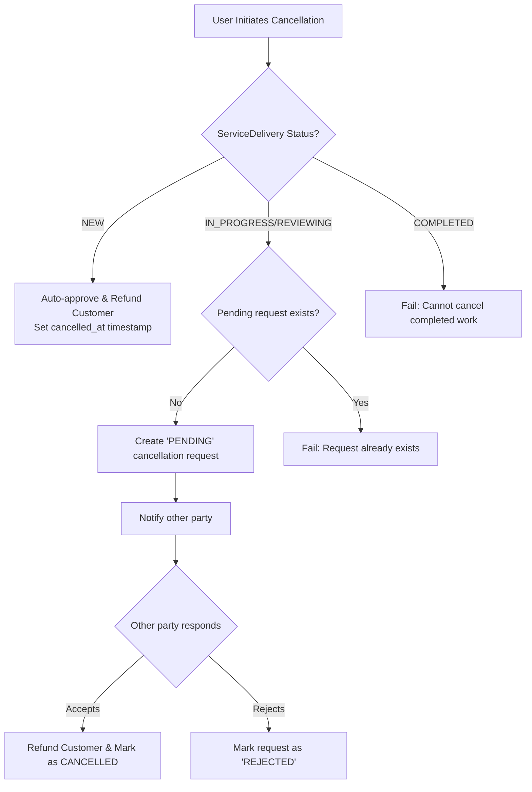

# Service Delivery Management

This document outlines the complete lifecycle of service delivery execution in the Brooder platform. **ServiceDeliveries** handle the actual service execution workflow after an order payment has been processed successfully.

---

## ServiceDelivery Lifecycle Overview

ServiceDelivery represents the actual execution phase of a service, completely separate from payment processing. Here's the complete lifecycle:

---

## ServiceDelivery Status Reference

| Status | Description | Who Controls | Next Actions |
|--------|-------------|--------------|-------------|
| `NEW` | Created automatically when order is paid | System | Provider can accept |
| `IN_PROGRESS` | Provider has started working | Provider | Provider can deliver |
| `REVIEWING` | Work delivered, awaiting customer review | Customer | Customer can accept/request changes |
| `COMPLETED` | Service fully completed | Customer | Final settlement occurs |
| `CANCELLED` | Service cancelled by either party | Both | Refund processed |

---

## Detailed Workflow

### Step 1: Automatic Creation (System)

ServiceDeliveries are created automatically by the `OrderObserver` when an order reaches `COMPLETED` status:

**Automatic Creation Details:**
- **Endpoint:** None (automatic process)
- **Trigger:** Order status changes to `COMPLETED`
- **Action:** `ServiceDeliveryLogic::createServiceDeliveryFromOrder()`

---

### Step 2: Provider Accepts Work

Provider accepts the service delivery to begin working:

-   **Endpoint:** `PATCH /api/v1/provider/service-deliveries/{id}/status/in-progress`
-   **Authorization:** Bearer Token (Provider)
-   **Action:** `Providers\ServiceDeliveries\ChangeServiceDeliveryStatusToInProgressAction`
-   **Status Change:** `NEW` → `IN_PROGRESS`

#### Process Flow

---

### Step 3: Provider Delivers Work

Provider completes the work and submits for customer review:

-   **Endpoint:** `PATCH /api/v1/provider/service-deliveries/{id}/status/reviewing`
-   **Authorization:** Bearer Token (Provider)
-   **Action:** `Providers\ServiceDeliveries\ChangeServiceDeliveryStatusToReviewingAction`
-   **Status Change:** `IN_PROGRESS` → `REVIEWING`

#### Process Flow

---

### Step 4A: Customer Accepts Work (Completion Path)

Customer accepts the delivered work, triggering final settlement:

-   **Endpoint:** `PATCH /api/v1/customer/service-deliveries/{id}/status/completed`
-   **Authorization:** Bearer Token (Customer)
-   **Action:** `Customers\ServiceDeliveries\ChangeServiceDeliveryStatusToCompletedAction`
-   **Status Change:** `REVIEWING` → `COMPLETED`

#### Process Flow

#### Financial Settlement Details

---

### Step 4B: Customer Requests Changes (Revision Path)

Customer requests modifications to the delivered work:

-   **Endpoint:** `POST /api/v1/customer/service-deliveries/{id}/update-requests`
-   **Authorization:** Bearer Token (Customer)
-   **Action:** `Customers\ServiceDeliveries\UpdateServiceDeliveryRequest\StoreUpdateServiceDeliveryRequestAction`
-   **Status Change:** `REVIEWING` → `IN_PROGRESS`

#### Request Body

| Field | Type | Rules | Description |
|-------|------|-------|-------------|
| `content` | `string` | `required`, `min:10` | Description of requested changes |

#### Process Flow

---

## Common Actions

### Listing Service Deliveries

Both customers and providers can retrieve their service deliveries:

-   **Endpoint:** `GET /api/v1/{user_type}/service-deliveries`
-   **`user_type`:** `customer` or `provider`
-   **Authorization:** Bearer Token
-   **Action:** `Shared\ServiceDeliveries\IndexServiceDeliveryAction`

### Show Service Delivery Details

-   **Endpoint:** `GET /api/v1/{user_type}/service-deliveries/{id}`
-   **Authorization:** Bearer Token
-   **Action:** `{UserType}\ServiceDeliveries\ShowServiceDeliveryAction`

---

## Cancellation Workflow

ServiceDelivery cancellations follow a sophisticated workflow based on the current status:

### Cancellation Rules by Status

| ServiceDelivery Status | Cancellation Type | Process |
|----------------------|------------------|---------|
| `NEW` | Immediate | Auto-approved, instant refund |
| `IN_PROGRESS` | Request/Response | Requires other party agreement |
| `REVIEWING` | Request/Response | Requires other party agreement |
| `COMPLETED` | Not Allowed | Cannot cancel completed work |

### Cancellation Endpoints

1.  **Request Cancellation**: `POST /api/v1/{user_type}/service-deliveries/{id}/cancel`
2.  **View Cancellation Requests**: `GET /api/v1/{user_type}/service-deliveries/{id}/cancel`
3.  **Accept Cancellation**: `PATCH /api/v1/{user_type}/service-deliveries/{id}/cancel/{cancel_id}/accept`
4.  **Reject Cancellation**: `PATCH /api/v1/{user_type}/service-deliveries/{id}/cancel/{cancel_id}/reject`

### Cancellation Process Flow

---

## Reviews System

After a ServiceDelivery is completed, customers can leave reviews:

-   **Endpoint:** `POST /api/v1/customer/service-deliveries/{id}/reviews`
-   **Authorization:** Bearer Token (Customer)
-   **Prerequisite:** ServiceDelivery status must be `COMPLETED`

### Review Request Body

| Field | Type | Rules | Description |
|-------|------|-------|-------------|
| `rate` | `integer` | `required`, `min:1`, `max:5` | Rating from 1 to 5 stars |
| `content` | `string` | `required`, `min:10` | Review content |

---

## Key Concepts & Features

### **Status Enforcement**
Each action includes strict status validation to prevent invalid transitions:
- `NEW` → `IN_PROGRESS` only
- `IN_PROGRESS` → `REVIEWING` only
- `REVIEWING` → `COMPLETED` or back to `IN_PROGRESS`

### **Transactional Integrity**
Critical operations (completion, cancellation) are wrapped in database transactions to ensure data consistency.

### **Notification System**
Status changes trigger notifications to relevant parties:
- Provider notifications for customer actions
- Customer notifications for provider actions

### **Financial Settlement**
Only completed ServiceDeliveries trigger fund distribution from the escrow wallet.

### **Audit Trail**
All status changes and timestamps are tracked:
- `started_at`: When work begins
- `delivered_at`: When work is completed
- `cancelled_at`: When cancelled

This concludes the ServiceDelivery Management documentation. For order payment processing, see the [Order Management documentation](./orders-management.md). 