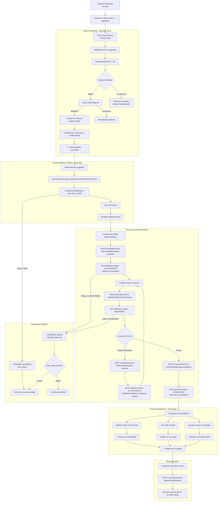

# Service Order Flow

This document provides a comprehensive visual overview of the complete service order and delivery flow in the Brooder platform, from initial customer order creation through final service completion and financial settlement.

---

## Complete System Flow

The following diagram illustrates the entire journey of a service order through the Brooder platform, showing how Orders (payment processing) seamlessly transition to ServiceDeliveries (service execution):

---

## Flow Summary

This comprehensive flow demonstrates the separation of concerns in the new Brooder architecture:

### 🏦 **Order Stage (Payment Processing)**
- Customer selects service and upgrades
- Payment validation and processing
- Funds held in escrow (General System wallet)
- Order marked as `COMPLETED` upon successful payment

### 🔄 **Automatic Transition**
- OrderObserver detects completed order
- ServiceDelivery automatically created
- Provider receives notification

### ⚙️ **Service Execution Stage**
- Provider accepts work (`NEW` → `IN_PROGRESS`)
- Provider delivers work (`IN_PROGRESS` → `REVIEWING`)
- Customer reviews and either accepts or requests changes
- Possible revision cycles until satisfaction

### 💰 **Financial Settlement**
- Only triggered when ServiceDelivery reaches `COMPLETED`
- Funds distributed from escrow to:
  - Provider wallet (majority of funds)
  - Tax wallet (15% of platform profit)
  - Profit wallet (20% of total amount)

### 🚫 **Cancellation Handling**
- Immediate cancellation for `NEW` ServiceDeliveries
- Request/approval process for active ServiceDeliveries
- Automatic refund processing

### ⭐ **Review System**
- Post-completion review capability
- Affects provider ratings and platform reputation

---

## Key Benefits of This Flow

1. **Clear Separation**: Payment and service execution are completely separate
2. **Financial Security**: Escrow system protects both parties
3. **Flexibility**: Revision cycles ensure customer satisfaction
4. **Automation**: Minimal manual intervention required
5. **Transparency**: Clear status tracking throughout the process

For detailed documentation on each stage, see:
- [Order Management](./orders-management.md) - Payment processing
- [Service Delivery Management](./service-delivery-management.md) - Service execution 