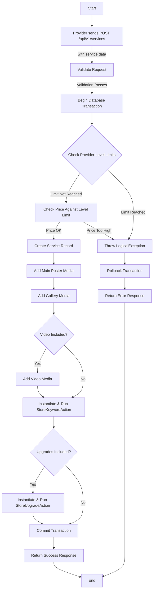

# Service Management

This workflow covers how services are managed by Providers and viewed by Customers. Providers have full CRUD (Create, Read, Update, Delete) capabilities for their services, while Customers can browse and view service details.

## Endpoints

### Provider Endpoints

These endpoints are for providers to manage their own services.

*   **List Own Services:** `GET /api/v1/services`
*   **Create Service:** `POST /api/v1/services`
*   **Show Service:** `GET /api/v1/services/{id}`
*   **Update Service:** `PATCH /api/v1/services/{id}`
*   **Delete Service:** `DELETE /api/v1/services/{id}`
*   **List Service Reviews:** `GET /api/v1/services/{id}/reviews`

### Customer Endpoints

These endpoints are for customers to discover services.

*   **List All Services:** `GET /api/v1/services`
*   **Show Service:** `GET /api/v1/services/{id}`
*   **List Service Reviews:** `GET /api/v1/services/{id}/reviews`
*   **List a Specific Provider's Services:** `GET /api/v1/providers/{id}/services`

## Process Flow (Provider: Create Service)



## Request Body (Provider: Create Service)

This is a complex endpoint with many possible fields.

| Field                     | Type                               | Description                                                                                               |
| ------------------------- | ---------------------------------- | --------------------------------------------------------------------------------------------------------- |
| `title`                   | `string`                           | The title of the service. (min: 10, max: 100)                                                             |
| `description`             | `string`                           | A detailed description of the service. (min: 300, max: 900)                                               |
| `additional_instructions` | `string` (optional)                | Any extra instructions for the customer. (min: 2, max: 500)                                               |
| `price`                   | `integer`                          | The base price of the service. (min: 5)                                                                   |
| `delivery_unit`           | `enum`                             | The unit for the delivery time. E.g., `day`, `week`.                                                      |
| `delivery_time`           | `integer`                          | The number of units for the delivery time. (min: 1)                                                       |
| `new_key_words`           | `array` (optional)                 | An array of new keyword strings to create.                                                                |
| `old_key_words`           | `array` (optional)                 | An array of existing keyword IDs to associate.                                                            |
| `main_poster`             | `file`                             | The primary image for the service. (png, jpg, jpeg, gif; max: 2MB)                                        |
| `gallery`                 | `array` (max: 3)                   | An array of up to 3 image files for the gallery.                                                          |
| `video`                   | `file` (optional)                  | A video showcasing the service. (mp4; max: 10MB)                                                          |
| `subcategory_id`          | `integer`                          | The ID of the subcategory this service belongs to.                                                        |
| `upgrades`                | `array` (optional)                 | An array of upgrade objects. See below.                                                                   |

### Upgrade Object Structure

| Field           | Type      | Description                             |
| --------------- | --------- | --------------------------------------- |
| `title`         | `string`  | The title of the upgrade.               |
| `price`         | `integer` | The additional price for the upgrade.   |
| `delivery_unit` | `enum`    | The unit for the extra delivery time.   |
| `delivery_time` | `integer` | The extra delivery time for the upgrade.|

## Responses

### Success Response (200 OK)

```json
{
    "status": "success",
    "message": "Data has been created successfully."
}
```

### Error Response (422 Unprocessable Entity)

If validation fails, a standard validation error response is returned.

### Logical Error Response (400 Bad Request)

If a business rule is violated (e.g., service limit reached).

```json
{
    "status": "error",
    "message": "You have reached the maximum number of services allowed for your level."
}
```

## Code Highlights & Key Concepts

*   **Provider Level Enforcement:** The `StoreServiceAction` first checks the provider's level to enforce business rules. It ensures the provider hasn't exceeded their allowed number of services and that the service price is within the allowed maximum for their level. This is a critical piece of business logic.
*   **Database Transactions:** The entire creation process is wrapped in a `DB::transaction()`. This ensures that if any part of the process fails (e.g., media upload, keyword creation), the entire operation is rolled back, preventing partially created services and maintaining data integrity.
*   **Delegation to Other Actions:** Instead of putting all the logic in one massive action, the `StoreServiceAction` delegates the responsibility of creating keywords and upgrades to `StoreKeywordAction` and `StoreUpgradeAction` respectively. This follows the Single Responsibility Principle and makes the code more organized and maintainable.
*   **Spatie Media Library:** The action uses the popular `spatie/laravel-medialibrary` package to handle file uploads (`main_poster`, `gallery`, `video`). It associates each file with a specific "media collection" for easy retrieval and management.

This concludes the documentation for the Service Management workflow.
