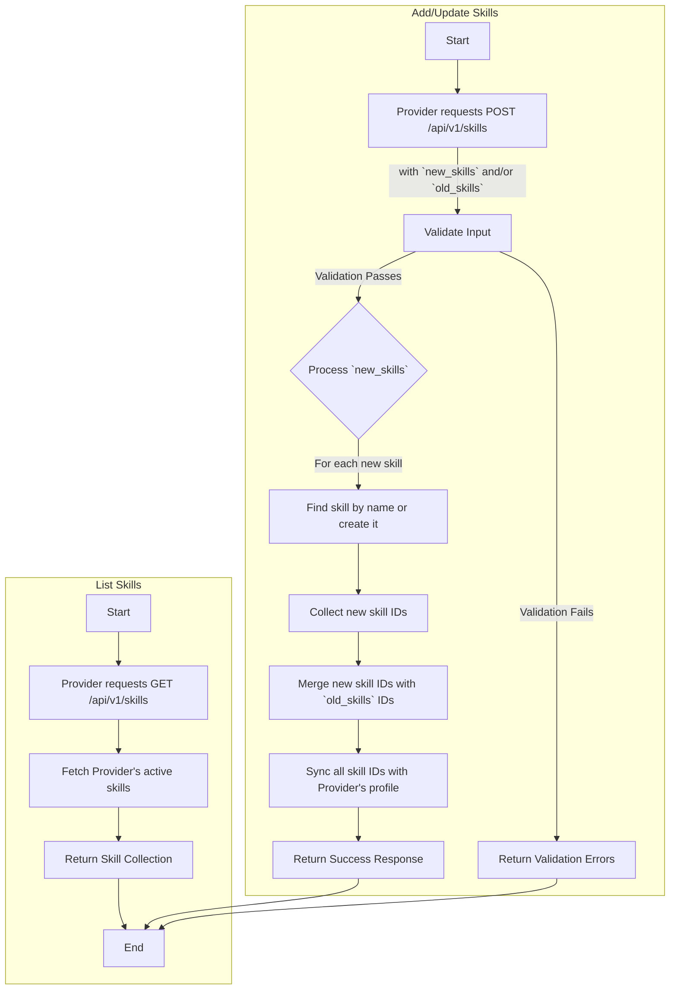
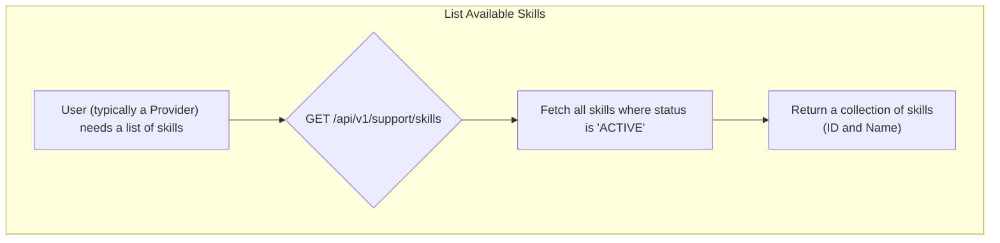

# Skill Management (Provider)

This workflow describes how a Provider can manage their skills. They can add brand new skills to the platform or associate existing skills with their profile.

**Note:** While this document is in the "Shared" section, these endpoints are available only to users authenticated as a **Provider**.

## Endpoints

### 1. List Provider's Skills

Retrieves a list of the authenticated provider's currently active skills.

*   **Endpoint:** `GET /api/v1/skills`
*   **Authorization:** Bearer Token (Provider)
*   **Action:** `Providers\Skills\IndexSkillController`

### 2. Add/Update Provider's Skills

Adds new skills and/or attaches existing skills to the provider's profile. This action uses `sync`, meaning any skills not included in the request will be detached from the provider.

*   **Endpoint:** `POST /api/v1/skills`
*   **Authorization:** Bearer Token (Provider)
*   **Action:** `Providers\Skills\StoreSkillController`

## Process Flow



## Request Body for Add/Update

The request must contain at least one of the following arrays.

| Field          | Type    | Description                                                                 |
| -------------- | ------- | --------------------------------------------------------------------------- |
| `new_skills`   | `array` | An array of strings, where each string is the name of a new skill to create. |
| `old_skills`   | `array` | An array of integers, where each integer is the ID of an existing skill.      |

### Example Request

```json
{
    "new_skills": [
        "Advanced SEO",
        "Content Marketing"
    ],
    "old_skills": [
        12,
        34
    ]
}
```

## Responses

### List Skills: Success Response (`200 OK`)

```json
{
    "status": "success",
    "message": "Data has been retrieved successfully.",
    "data": [
        {
            "id": 12,
            "name": "Graphic Design"
        },
        {
            "id": 34,
            "name": "Social Media Management"
        }
    ]
}
```

### Add/Update Skills: Success Response (`200 OK`)

```json
{
    "status": "success",
    "message": "Data has been created successfully."
}
```

### Add/Update Skills: Error Response (`422 Unprocessable Entity`)

```json
{
    "message": "The given data was invalid.",
    "errors": {
        "new_skills.0": [
            "The new_skills.0 must be a string."
        ],
        "old_skills": [
            "The old_skills field is required when new_skills is not present."
        ]
    }
}
```

## Code Highlights & Key Concepts

*   **`firstOrCreate` for Efficiency:** The `StoreSkillAction` cleverly uses `Skill::firstOrCreate(['name' => $skillName])`. This command attempts to find a skill with the given name. If it exists, it returns that model. If not, it creates a new one. This prevents duplicate skills from being created in the database.
*   **`sync` for Simplicity:** The action uses the `sync()` method on the `skills()` relationship. This is a powerful Eloquent method that accepts an array of IDs. It automatically attaches the new IDs, detaches any IDs that were previously associated but are not in the new array, and leaves existing associations that are in the array untouched. This single command handles the logic for adding, removing, and keeping skills in one go.
*   **Flexible Request Validation:** The `StoreSkillRequest` uses the `required_without_all` validation rule. This ensures that the request is valid as long as it contains either `new_skills` or `old_skills` (or both), making the API flexible for the client.

This concludes the documentation for the Provider Skill Management workflow.

---

sidebar_position: 4
---

# Skills Management

This workflow describes how to fetch a list of all available skills in the system. This is a shared utility endpoint, primarily used to populate selection interfaces, such as when a Provider is adding skills to their profile.

---

## Flow Diagram

### List Available Skills


---

## 1. List Available Skills

Retrieves a simple list of all skills that are currently active in the system.

-   **Endpoint:** `GET /api/v1/support/skills`
-   **Method:** `GET`
-   **Authentication:** Required (Provider or Customer Token)

### Success Response (200 OK)
Returns an array of skill objects, each containing just the `id` and `name`.
```json
{
    "message": "Data retrieved successfully.",
    "data": [
        {
            "id": 1,
            "name": "Graphic Design"
        },
        {
            "id": 2,
            "name": "Video Editing"
        },
        {
            "id": 3,
            "name": "Content Writing"
        }
    ]
}
```

### Note on Provider's Skills

-   The lifecycle of skills themselves (creating, editing, activating) is managed by **Admins**.
-   The process of a **Provider** adding, removing, and viewing the skills on their own profile is documented in the **Provider** workflows. This endpoint simply provides the master list of options to choose from.

---

### Code Highlights & Key Concepts

1.  **Scoped Query (`IndexSkillAction`)**: The action uses `Skill::query()->active()`. The `active()` part is a local query scope defined on the `Skill` model. This is an excellent Eloquent feature that makes the code more readable and reusable. Instead of writing `->where('status', 'active')` everywhere, we have a descriptive method `->active()` that can be easily reused and hides the underlying implementation detail of the `status` column.

2.  **Lean Data Transfer**: The query uses `select(['id', 'name'])`. This is a performance optimization that ensures only the necessary data is retrieved from the database and sent to the client. For a simple list, there's no need to transfer heavier fields like `created_at` or `updated_at`, which reduces the payload size and improves response time.
