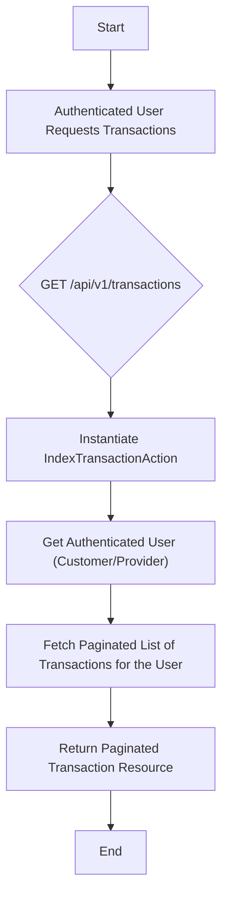

# Transaction History

This workflow allows a user, either a Customer or a Provider, to retrieve a paginated list of their financial transactions.

## Endpoint

### List Transactions

This endpoint fetches the transaction history for the authenticated user.

*   **Endpoint:** `GET /api/v1/transactions`
*   **Authorization:**
    *   Bearer Token (Customer)
    *   Bearer Token (Provider)
*   **Action:** `Shared\Transactions\IndexTransactionController`

## Process Flow



## Query Parameters

| Field              | Type    | Description                                       | Default |
| ------------------ | ------- | ------------------------------------------------- | ------- |
| `page`             | `integer` | The page number to retrieve.                      | `1`     |
| `records_per_page` | `integer` | The number of transactions to return per page.    | `15`    |

## Response Body

The response is a standard paginated resource containing a list of transactions.

### Success Response (`200 OK`)

```json
{
    "status": "success",
    "message": "Data has been retrieved successfully.",
    "data": [
        {
            "id": "txn_12345",
            "type": "deposit",
            "amount": "100.00",
            "currency": "SAR",
            "description": "Wallet deposit",
            "created_at": "2023-10-27T10:00:00Z"
        },
        {
            "id": "txn_67890",
            "type": "payment",
            "amount": "-50.00",
            "currency": "SAR",
            "description": "Payment for Order #123",
            "created_at": "2023-10-26T15:30:00Z"
        }
    ],
    "links": {
        "first": "http://localhost/api/v1/transactions?page=1",
        "last": "http://localhost/api/v1/transactions?page=5",
        "prev": null,
        "next": "http://localhost/api/v1/transactions?page=2"
    },
    "meta": {
        "current_page": 1,
        "from": 1,
        "last_page": 5,
        "path": "http://localhost/api/v1/transactions",
        "per_page": 2,
        "to": 2,
        "total": 10
    }
}
```

## Code Highlights & Key Concepts

*   **Polymorphic Relationship:** The system likely uses a polymorphic relationship on the `Transaction` model. This allows a single `transactions` table to store records for different types of models (in this case, `Customer` and `Provider`) by having `transactable_id` and `transactable_type` columns.
*   **Simple & Reusable:** The `IndexTransactionAction` is very simple. It retrieves the authenticated user, which can be either a `Customer` or `Provider`, and then calls the `transactions()` relationship on that user model. This makes the code clean, reusable, and easy to understand.
*   **Standard Pagination:** The endpoint uses Laravel's standard `paginate()` method, which automatically handles the pagination logic and provides a consistent, well-structured JSON response with `data`, `links`, and `meta` objects. This is a best practice for API design.

This concludes the documentation for the shared Transaction History workflow.
