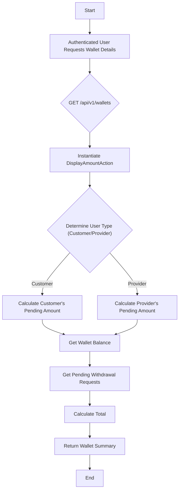

# Wallet Management

This workflow describes how a user, either a Customer or a Provider, can retrieve their wallet balance and other related financial metrics. A user's wallet balance is modified by [Transactions](./transactions) and can be paid out via [Withdrawal Requests](./withdrawal-requests).

## Endpoint

### Get Wallet Details

This endpoint provides a summary of the user's wallet, including available balance, pending amounts, and pending withdrawal requests.

*   **Endpoint:** `GET /api/v1/wallets`
*   **Authorization:**
    *   Bearer Token (Customer)
    *   Bearer Token (Provider)
*   **Action:** `Shared\Wallets\DisplayAmountController`

## Process Flow



## Response Body

The response contains a detailed breakdown of the user's wallet.

| Field                 | Type    | Description                                                                                               |
| --------------------- | ------- | --------------------------------------------------------------------------------------------------------- |
| `amount`              | `float` | The current available balance in the user's wallet.                                                       |
| `pending_amount`      | `float` | The amount that is currently pending and not yet available in the wallet. See calculation logic below.      |
| `withdrawal_requests` | `float` | The total amount of withdrawal requests that are currently pending. See [Withdrawal Requests](./withdrawal-requests) for more. |
| `total`               | `float` | The total sum of `amount`, `pending_amount`, and `withdrawal_requests`.                                   |

### Success Response (`200 OK`)

```json
{
    "status": "success",
    "message": "Data has been retrieved successfully.",
    "data": {
        "amount": 1500.50,
        "pending_amount": 250.00,
        "withdrawal_requests": 500.00,
        "total": 2250.50
    }
}
```

## Code Highlights & Key Concepts

*   **Unified Action, Role-Specific Logic:** The `DisplayAmountAction` serves both Customers and Providers. Inside the action, it checks the `last_login_type` of the authenticated user to determine which calculation logic to apply for the `pending_amount`.
*   **Pending Amount Calculation (Customer):** For a Customer, the `pending_amount` is the sum of the `total_price` of all their orders that are not yet `COMPLETED` and not `cancelled`. This represents money that is "on hold" for active orders.
*   **Pending Amount Calculation (Provider):** For a Provider, the calculation is more complex. For each order that is not `COMPLETED` and not `cancelled`, the system calculates the provider's profit. This involves:
    1.  Calculating the platform's profit (20% of the order's `total_price`).
    2.  Calculating the tax on the platform's profit (15% of the profit).
    3.  Subtracting the platform's profit and the tax from the order's `total_price` to get the provider's net profit for that order.
    The `pending_amount` is the sum of these net profits from all active orders.
*   **Withdrawal Requests:** The `withdrawal_requests` value is the sum of all [Withdrawal Requests](./withdrawal-requests) for the user that have a `PENDING` status. This gives the user a clear picture of how much money is in the process of being transferred out of their wallet.

This concludes the documentation for the shared Wallet Management workflow.
