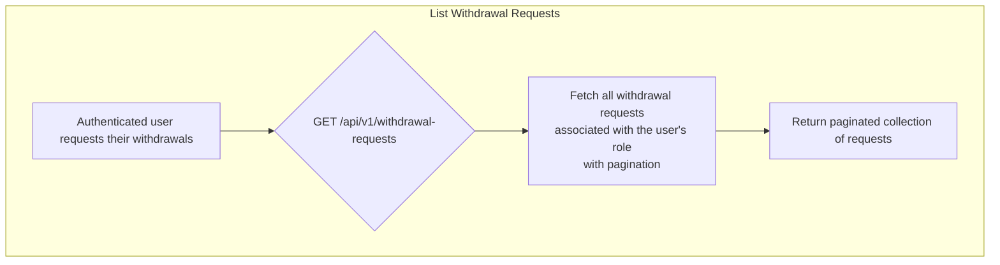
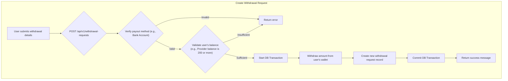
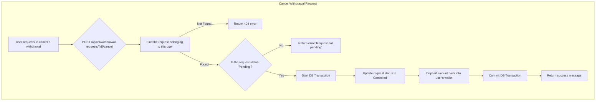

# Withdrawal Requests

This workflow outlines the process for Customers and Providers to request withdrawals of their account balance and to cancel pending requests.

---

## Flow Diagrams

### List Withdrawal Requests



### Create Withdrawal Request



### Cancel Withdrawal Request


---

## 1. List Withdrawal Requests

Retrieves a paginated list of all withdrawal requests associated with the authenticated user.

-   **Endpoint:** `GET /api/v1/withdrawal-requests`
-   **Method:** `GET`
-   **Authentication:** Required (Customer or Provider Token)

### Success Response (200 OK)
Returns a paginated list of the user's withdrawal request objects.

```json
{
    "message": "Data retrieved successfully.",
    "data": [
        {
            "id": 1,
            "amount": 500.00,
            "status": "Pending",
            "created_at": "2023-10-27T10:00:00.000000Z",
            "method": {
                "id": 1,
                "bank_name": "Al-Rajhi Bank",
                "account_number": "SA1234567890123456789012"
            }
        }
    ]
}
```

---

## 2. Create Withdrawal Request

Creates a new withdrawal request for the authenticated user's entire available balance.

-   **Endpoint:** `POST /api/v1/withdrawal-requests`
-   **Method:** `POST`
-   **Authentication:** Required (Customer or Provider Token)

### Request Body
| Parameter     | Type    | Rules                                    |
| ------------- | ------- | ---------------------------------------- |
| `method_type` | string  | Required. Must be `bank_account`.        |
| `method_id`   | integer | Required. The ID of the `BankAccount`.   |

### Success Response (200 OK)
```json
{
    "message": "Withdrawal request created successfully."
}
```

### Error Responses
-   **422 Unprocessable Entity:**
    -   If the `method_type` is not supported.
    -   If the `method_id` is invalid.
    -   If the user's balance does not meet the minimum requirement (e.g., 200 or more for Providers).
    -   If a Customer has no balance (zero or less).

---

## 3. Cancel Withdrawal Request

Cancels a user's pending withdrawal request.

-   **Endpoint:** `POST /api/v1/withdrawal-requests/{id}/cancel`
-   **Method:** `POST`
-   **Authentication:** Required (Customer or Provider Token)

### URL Parameters
| Parameter | Type    | Description                               |
| --------- | ------- | ----------------------------------------- |
| `id`      | integer | The ID of the withdrawal request to cancel. |

### Success Response (200 OK)
```json
{
    "message": "Withdrawal request cancelled successfully."
}
```

### Error Responses
-   **404 Not Found:** If the `id` does not correspond to a withdrawal request owned by the user.
-   **422 Unprocessable Entity:** If the request's status is not `Pending`.

---

### Code Highlights & Key Concepts

1.  **Database Transactions (`Create` and `Cancel` actions)**: Both creating and canceling a withdrawal are multi-step operations that must be atomic. For example, when creating a request, the system must (1) withdraw from the user's balance and (2) create the request record. If step 2 failed, the user's money would be gone without a record. By wrapping these operations in `DB::transaction()`, we ensure that if any step fails, the entire operation is rolled back, preventing data inconsistency. This is a critical pattern for financial operations.

2.  **Role-Specific Validation (`CreateWithdrawalRequestsAction`)**: The `validateBalance` method demonstrates how to apply different business rules based on the user's role. It checks `if ($user instanceof Provider)` to enforce a minimum withdrawal amount of 200, while for Customers, it simply ensures they have a positive balance. This is a clean way to handle logic that differs between user types.

3.  **Status-Change Integrity (`CancelWithdrawalRequestAction`)**: The action first checks if the request is still `Pending`. This is a vital safeguard to prevent users from canceling a request that has already been processed (`Completed`) or rejected (`Rejected`). This prevents race conditions and ensures the state machine of the withdrawal process is respected. The amount is then safely returned to the user's wallet.
