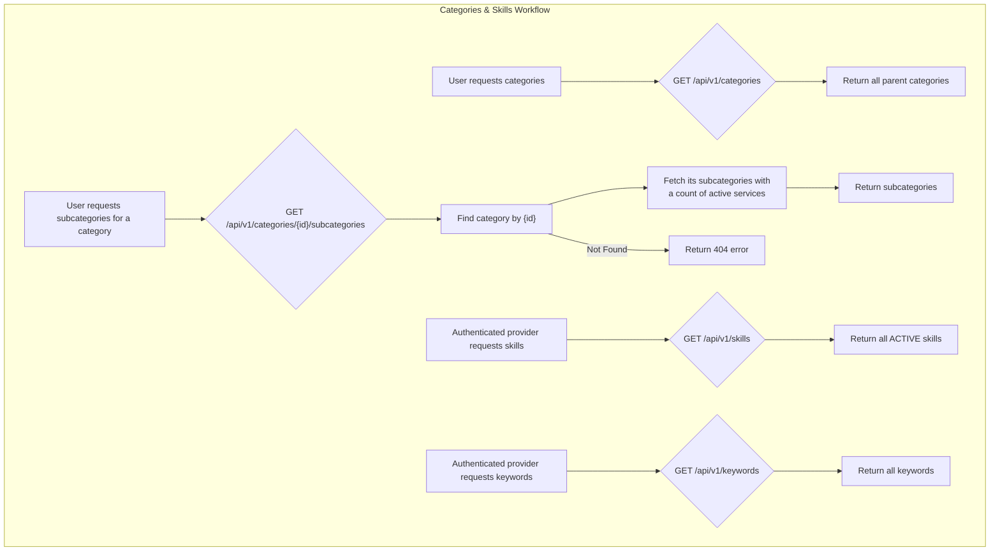

# Categories, Skills, and Keywords

This workflow provides the necessary data for providers to accurately define their services. It includes endpoints for fetching service categories, subcategories, and the skills and keywords used to describe service offerings.

---

## Flow Diagram



---

## 1. Get All Categories

This endpoint retrieves a list of all parent categories.

-   **Endpoint:** `GET /api/v1/categories`
-   **Method:** `GET`
-   **Authentication:** Not required

### Success Response (200 OK)
```json
{
    "message": "Data retrieved successfully.",
    "data": [
        {"id": 1, "name_ar": "تصميم", "name_en": "Design"},
        {"id": 2, "name_ar": "تطوير", "name_en": "Development"}
    ]
}
```

---

## 2. Get Subcategories by Category

This endpoint retrieves a list of subcategories for a given parent category ID.

-   **Endpoint:** `GET /api/v1/categories/{id}/subcategories`
-   **Method:** `GET`
-   **Authentication:** Not required

### URL Parameters
| Parameter | Type    | Description                   |
| --------- | ------- | ----------------------------- |
| `id`      | integer | The ID of the parent category. |

### Success Response (200 OK)
Returns subcategory objects, including a count of active services in each.
```json
{
    "message": "Data retrieved successfully.",
    "data": [
        {
            "id": 10,
            "name_ar": "تصميم شعار",
            "name_en": "Logo Design",
            "services_count": 150
        },
        {
            "id": 11,
            "name_ar": "تصميم واجهة مستخدم",
            "name_en": "UI Design",
            "services_count": 85
        }
    ]
}
```

---

## 3. Get All Skills

This endpoint retrieves a list of all **active** skills that providers can associate with their services.

-   **Endpoint:** `GET /api/v1/skills`
-   **Method:** `GET`
-   **Authentication:** Required (Provider Token)

### Success Response (200 OK)
```json
{
    "message": "Data retrieved successfully.",
    "data": [
        {"id": 1, "name": "PHP"},
        {"id": 2, "name": "JavaScript"}
    ]
}
```

---

## 4. Get All Keywords

This endpoint retrieves a list of all keywords that providers can use to tag their services.

-   **Endpoint:** `GET /api/v1/keywords`
-   **Method:** `GET`
-   **Authentication:** Required (Provider Token)

### Success Response (200 OK)
```json
{
    "message": "Data retrieved successfully.",
    "data": [
        {"id": 1, "name": "fast-delivery"},
        {"id": 2, "name": "e-commerce"}
    ]
}
```

---

### Code Highlights & Key Concepts

1.  **Efficient Subquery (`IndexSubcategoryAction`)**: The endpoint for subcategories includes a `services_count`. The code calculates this efficiently using a `withCount()` method. This is much better for performance than loading all services for each subcategory and then counting them in PHP. Laravel translates this into a single, optimized subquery, preventing the "N+1 query problem."

2.  **Scope for Active Skills (`IndexSkillAction`)**: The `IndexSkillAction` uses `Skill::query()->active()`. The `active()` part is a **local query scope** defined on the `Skill` model. This is a great practice for reusing common query constraints. Instead of writing `->where('status', 'active')` in every controller or action, you define it once in the model, making the code cleaner, more readable, and less prone to errors.

3.  **Authentication Context**: Notice that fetching categories/subcategories is public (no authentication), as this information might be needed for browsing the site. However, fetching `skills` and `keywords` requires a provider token. This implies that this data is specifically for the context of a provider creating or editing a service, not for general public consumption.
