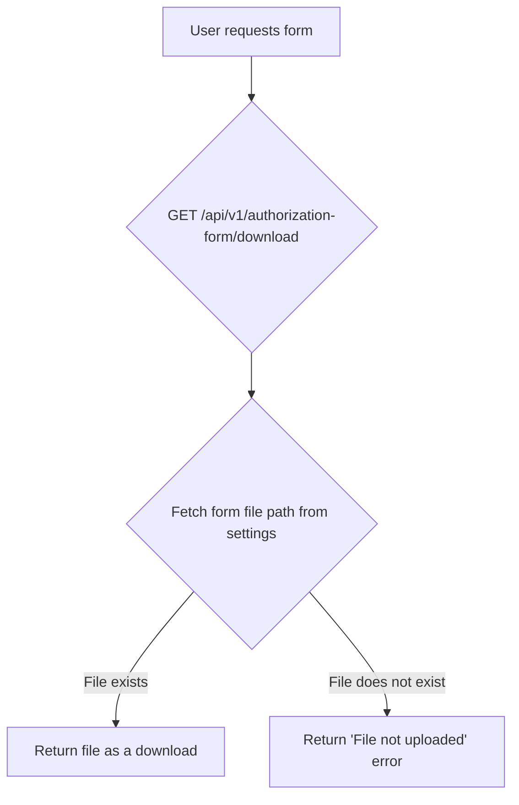
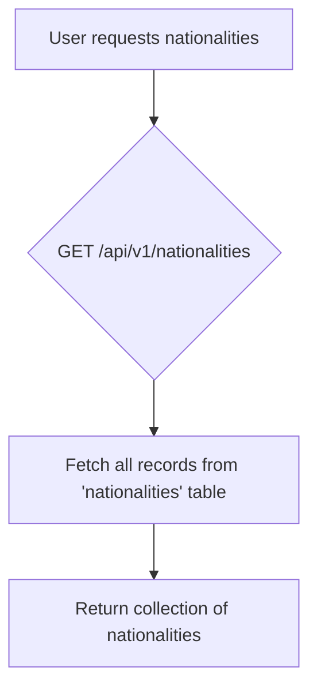
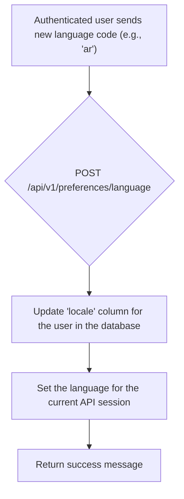

# General Support

This document covers miscellaneous support endpoints for downloading forms, retrieving lists of nationalities, and managing user language preferences.

---

## Flow Diagrams

### Download Authorization Form


### Get Nationalities


### Set Language Preference


---

## 1. Download Authorization Form

This endpoint allows any user to download the authorization form required for establishment providers.

-   **Endpoint:** `GET /api/v1/authorization-form/download`
-   **Method:** `GET`
-   **Authentication:** Not required

### Success Response (200 OK)
-   **Content-Type:** Varies (e.g., `application/pdf`, `image/png`)
-   The endpoint returns the authorization form file directly as a download.

### Error Response (422 Unprocessable Entity)
- If no authorization form file has been uploaded by the admin in the settings panel.

---

## 2. Get All Nationalities

This endpoint retrieves a list of all available nationalities for use in registration and profile forms.

-   **Endpoint:** `GET /api/v1/nationalities`
-   **Method:** `GET`
-   **Authentication:** Not required

### Success Response (200 OK)
Returns an array of nationality objects.
```json
{
    "message": "Data retrieved successfully.",
    "data": [
        {
            "id": 1,
            "name_ar": "سعودي",
            "name_en": "Saudi",
            "code": "SA"
        },
        {
            "id": 2,
            "name_ar": "مصري",
            "name_en": "Egyptian",
            "code": "EG"
        }
    ]
}
```

---

## 3. Set Language Preference

Allows an authenticated user to set their preferred language for communications and display.

-   **Endpoint:** `POST /api/v1/preferences/language`
-   **Method:** `POST`
-   **Authentication:** Required (User Token)

### Request Body

| Parameter | Type   | Rules                  |
| --------- | ------ | ---------------------- |
| `locale`  | string | Required, e.g., 'en', 'ar'. |

### Success Response (200 OK)
```json
{
    "message": "Locale has been set successfully."
}
```

---

### Code Highlights & Key Concepts

1.  **Dynamic Settings (`DownloadAuthorizationFormAction`)**: The authorization form is not a static file in the project. Its path is stored in the database via the `laravel-settings` package. The `DownloadAuthorizationFormAction` retrieves this setting and throws a clear error if the admin has not uploaded the file yet. This makes the form easily updatable by an admin without requiring a new code deployment.

2.  **Persistent and Session-wide Language (`SetLocaleAction`)**: The `SetLocaleAction` does two important things when a user changes their language:
    a. **It persists the choice**: `getAuthenticatable()->update(['locale' => ...])` saves the user's preference to the database, so it will be their default language in the future.
    b. **It applies immediately**: `app()->setLocale(...)` changes the application's language for the *current request/session*. This means any subsequent emails, notifications, or localized messages generated during this session will use the new language right away.
