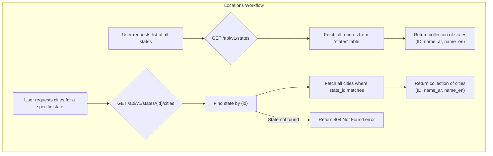

# Locations

This workflow provides endpoints to retrieve geographical data, specifically states and their associated cities. This data is essential for user registration and profile completion.

---

## Flow Diagram



---

## 1. Get All States

This endpoint retrieves a list of all available states.

-   **Endpoint:** `GET /api/v1/states`
-   **Method:** `GET`
-   **Authentication:** Not required

### Success Response (200 OK)
Returns an array of state objects.
```json
{
    "message": "Data retrieved successfully.",
    "data": [
        {
            "id": 1,
            "name_ar": "الرياض",
            "name_en": "Riyadh"
        },
        {
            "id": 2,
            "name_ar": "جدة",
            "name_en": "Jeddah"
        }
    ]
}
```

---

## 2. Get Cities by State

This endpoint retrieves a list of cities belonging to a specific state, identified by its ID.

-   **Endpoint:** `GET /api/v1/states/{id}/cities`
-   **Method:** `GET`
-   **Authentication:** Not required

### URL Parameters
| Parameter | Type    | Description              |
| --------- | ------- | ------------------------ |
| `id`      | integer | The ID of the parent state. |

### Success Response (200 OK)
Returns an array of city objects for the given state.
```json
{
    "message": "Data retrieved successfully.",
    "data": [
        {
            "id": 101,
            "name_ar": "الدرعية",
            "name_en": "Diriyah"
        },
        {
            "id": 102,
            "name_ar": "الخرج",
            "name_en": "Al-Kharj"
        }
    ]
}
```

### Error Response (404 Not Found)
- If the `id` provided in the URL does not correspond to an existing state.

---

### Code Highlights & Key Concepts

1.  **Simplicity and Performance**: The `IndexStateAction` and `IndexCityAction` are very direct. They use `::query()->select([...])->get()` to fetch data. The explicit use of `select()` is a good performance practice, as it ensures that only the necessary columns (`id`, `name_ar`, `name_en`) are retrieved from the database, reducing memory usage and query time.

2.  **Route Model Binding (Implicit)**: In the `IndexCityAction`, the line `$state = State::query()->findOrFail($id);` is a manual implementation of what Laravel can do automatically with Route Model Binding. It safely finds the parent `State` model or immediately throws a `404 Not Found` exception if the ID is invalid, preventing any further code execution. This is a robust way to handle nested resource routes.
